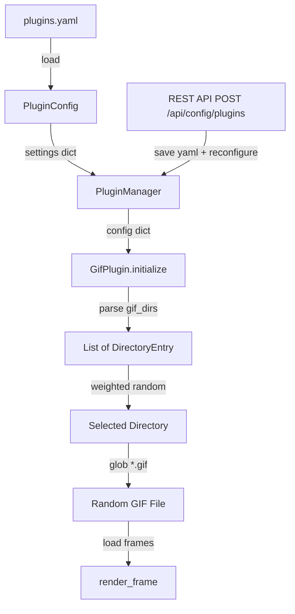

# Technical Design: GIF Directory Rotation

## Overview

This feature extends the existing `GifPlugin` to support multiple GIF source directories, each with a probability weight and a recursive-traversal flag. Currently the plugin reads from a single hardcoded directory. After this change, the user configures a list of `Directory_Entry` objects in `plugins.yaml`, and the plugin selects a directory via weighted random choice before picking a random GIF within that directory.

The implementation touches three layers:
1. **Plugin logic** (`gif_plugin.py`) — parsing `gif_dirs`, weighted directory selection, conditional recursive/non-recursive file discovery.
2. **Config schema declaration** — exposing the `gif_dirs` field so the Web UI can render a list editor.
3. **REST API** — no new endpoints; the existing `POST /api/config/plugins` already persists YAML and calls `reconfigure_plugin`, which invokes `GifPlugin.reconfigure()` (inherited default calls `initialize()`).

### Design Rationale

- **Dataclass for Directory_Entry**: Using a `@dataclass` gives us a typed, immutable-by-convention structure with clear defaults, better than a plain dict for readability and IDE support.
- **Parsing in `initialize()`**: Keeps the plugin self-contained — the plugin owns its config parsing. No changes to `PluginConfig` or `PluginManager`.
- **`random.choices` for weighted selection**: Standard library, supports weights directly, one-liner.
- **`field_type="list"` in config_schema**: The Web UI already reads config_schema dynamically; declaring `list` tells it to render an array editor with per-item fields described in the `description` text.

## Architecture



The existing data flow is preserved. The only changes are internal to `GifPlugin`:
- `initialize()` parses `gif_dirs` from the settings dict instead of reading a single `gif_dir` string.
- File discovery respects the `recursive` flag per entry.
- Directory selection uses weighted random.

## Components and Interfaces

### 1. `DirectoryEntry` dataclass

A new dataclass defined at module-level in `gif_plugin.py`:

```python
from dataclasses import dataclass

@dataclass
class DirectoryEntry:
    path: Path
    weight: int = 50
    recursive: bool = True
```

### 2. `GifPlugin` modifications

| Method / Property | Change |
|---|---|
| `config_schema` | Replace the single `gif_dir` text field with a `gif_dirs` list field. |
| `initialize(config)` | Parse `gif_dirs` list from settings, build `List[DirectoryEntry]`, validate entries (skip bad ones with warning), perform weighted directory selection, then pick a random GIF from the chosen directory. |
| `_resolve_directories(raw_dirs)` | New private method. Parses raw dicts into `DirectoryEntry` objects, logs warnings for invalid entries, returns valid entries. |
| `_select_gif(entries)` | New private method. Filters to directories with at least one GIF, performs weighted random choice on directories, then picks a random GIF file from the winner. Raises `PluginNotConfiguredError` if no GIFs anywhere. |

### 3. Config Schema Declaration

```python
@property
def config_schema(self) -> List[ConfigField]:
    return [
        ConfigField(
            "gif_dirs",
            "GIF Directories",
            "list",
            required=True,
            description="List of directory entries. Each entry: path (string), weight (integer, default 50), recursive (boolean, default true)",
        )
    ]
```

### 4. REST API (no changes required)

The existing `POST /api/config/plugins` endpoint:
1. Persists the full body to `plugins.yaml`.
2. Calls `pm.reconfigure_plugin("gif")`.
3. `reconfigure_plugin` reloads config from disk, then calls `plugin.reconfigure(config)`.
4. The default `reconfigure()` implementation calls `initialize()` — which now re-parses `gif_dirs`.

No new endpoints or handler modifications are needed.

## Data Models

### DirectoryEntry

```python
@dataclass
class DirectoryEntry:
    """A single GIF source directory with selection weight and traversal mode."""
    path: Path          # Resolved absolute path
    weight: int = 50    # Positive integer, probability weight
    recursive: bool = True  # Whether to descend into subdirectories
```

### plugins.yaml structure (GIF plugin section)

```yaml
plugins:
  - name: gif
    frequency: 100
    settings:
      gif_dirs:
        - path: "/home/pi/.zeclock/plugins/gif/retro"
          weight: 80
          recursive: true
        - path: "/home/pi/.zeclock/plugins/gif/memes"
          weight: 20
          recursive: false
```

### Config parsing logic (pseudo-code)

```python
def _resolve_directories(self, raw_dirs: list) -> List[DirectoryEntry]:
    entries = []
    for item in raw_dirs:
        if not isinstance(item, dict):
            logger.warning("[gif] Skipping non-dict entry in gif_dirs")
            continue
        path_str = item.get("path", "")
        if not path_str:
            logger.warning("[gif] Skipping entry with missing/empty path")
            continue
        resolved = Path(path_str).expanduser()
        if not resolved.is_dir():
            logger.warning("[gif] Directory does not exist: %s, skipping", resolved)
            continue
        weight = item.get("weight", 50)
        if not isinstance(weight, int) or weight < 1:
            weight = 50
        recursive = item.get("recursive", True)
        entries.append(DirectoryEntry(path=resolved, weight=weight, recursive=bool(recursive)))
    return entries
```

### Weighted selection logic

```python
def _select_gif(self, entries: List[DirectoryEntry]) -> Path:
    # Build pool: (entry, list_of_gifs)
    pool = []
    for entry in entries:
        if entry.recursive:
            gifs = list(entry.path.rglob("*.gif")) + list(entry.path.rglob("*.GIF"))
        else:
            gifs = list(entry.path.glob("*.gif")) + list(entry.path.glob("*.GIF"))
        if gifs:
            pool.append((entry, gifs))

    if not pool:
        raise PluginNotConfiguredError("Gif plugin: no .gif files found in any configured directory")

    # Weighted random directory selection
    dirs = [p[0] for p in pool]
    weights = [p[0].weight for p in pool]
    chosen_idx = random.choices(range(len(pool)), weights=weights, k=1)[0]
    chosen_gifs = pool[chosen_idx][1]

    return random.choice(chosen_gifs)
```

### Fallback behavior

When `gif_dirs` is absent from settings, the plugin falls back to a single default entry:

```python
if not raw_dirs:
    raw_dirs = [{"path": str(DEFAULT_GIF_DIR), "weight": 50, "recursive": True}]
```

## Correctness Properties

*A property is a characteristic or behavior that should hold true across all valid executions of a system — essentially, a formal statement about what the system should do. Properties serve as the bridge between human-readable specifications and machine-verifiable correctness guarantees.*

### Property 1: Config parsing produces correct DirectoryEntry objects with defaults

*For any* list of raw directory entry dicts (where each dict may or may not contain `weight` and `recursive` keys), parsing SHALL produce `DirectoryEntry` objects where: the `path` field matches the input path, missing `weight` defaults to 50, and missing `recursive` defaults to True.

**Validates: Requirements 1.1, 1.2**

### Property 2: Invalid entries are filtered from parsed results

*For any* list of raw directory entry dicts containing a mix of valid entries (non-empty `path` string pointing to an existing directory) and invalid entries (missing `path` key, empty string path, or non-existent path), the parsed result SHALL contain only the valid entries and SHALL exclude all invalid entries.

**Validates: Requirements 1.5, 2.3**

### Property 3: GIF selection only comes from non-empty directories

*For any* set of valid `DirectoryEntry` objects where at least one directory contains GIF files, the selected GIF file SHALL always be a file that exists within one of the directories that contains at least one GIF file. Directories with zero GIF files SHALL never contribute a selection.

**Validates: Requirements 3.1, 3.2**

### Property 4: All-empty configuration raises PluginNotConfiguredError

*For any* configuration where every `DirectoryEntry` path either does not exist, is not a directory, or contains zero `.gif` files, calling the selection function SHALL raise `PluginNotConfiguredError`.

**Validates: Requirements 3.3**

## Error Handling

| Scenario | Behavior |
|---|---|
| `gif_dirs` key absent from settings | Fall back to `DEFAULT_GIF_DIR` with weight=50 and recursive=true. |
| Entry dict missing `path` or path is empty string | Skip entry, log warning at WARNING level. |
| Entry `path` points to non-existent directory | Skip entry, log warning at WARNING level. |
| Entry `weight` is non-integer or < 1 | Default to 50. |
| All directories are empty or invalid | Raise `PluginNotConfiguredError` — plugin is marked "unconfigured" (not "failed") and shows "configure me" on DMD. |
| `reconfigure_plugin` called via REST API | Calls `initialize()` which re-parses `gif_dirs` from fresh config. If new config is invalid, raises `PluginNotConfiguredError`. |

No new exception types are introduced. The existing `PluginNotConfiguredError` is used for all "no GIFs available" scenarios.

## Testing Strategy

### Unit Tests (example-based)

| Test | Validates |
|---|---|
| Parse the exact YAML structure from Requirement 1.3 | Req 1.3 |
| `gif_dirs` absent → fallback to default directory | Req 1.4 |
| `config_schema` declares `gif_dirs` with `field_type="list"`, `required=True` | Req 4.1 |
| `config_schema` description mentions path, weight, recursive | Req 4.2 |
| Recursive discovery finds nested GIFs (temp directory fixture) | Req 2.1 |
| Non-recursive discovery ignores subdirectories (temp directory fixture) | Req 2.2 |
| REST POST persists and triggers reconfigure (mock PluginManager) | Req 5.1 |
| REST GET returns gif_dirs in response JSON | Req 5.2 |

### Property-Based Tests (Hypothesis)

The project uses Python with pytest. Property-based tests will use **Hypothesis** (`hypothesis` library).

Each property test runs a minimum of **100 iterations**.

| Property Test | Tag |
|---|---|
| Parsing with defaults | Feature: gif-directory-rotation, Property 1: Config parsing produces correct DirectoryEntry objects with defaults |
| Invalid entry filtering | Feature: gif-directory-rotation, Property 2: Invalid entries are filtered from parsed results |
| Selection from non-empty dirs | Feature: gif-directory-rotation, Property 3: GIF selection only comes from non-empty directories |
| All-empty raises error | Feature: gif-directory-rotation, Property 4: All-empty configuration raises PluginNotConfiguredError |

### Test Configuration

```python
from hypothesis import given, settings, strategies as st

@settings(max_examples=100)
@given(...)
def test_property_name(...):
    # Feature: gif-directory-rotation, Property N: <title>
    ...
```

### Integration Tests

- POST `/api/config/plugins` with `gif_dirs` → verify `plugins.yaml` written and plugin reconfigured (1 test case).
- GET `/api/config/plugins` → verify response includes `gif_dirs` with all fields (1 test case).

### What is NOT tested with PBT

- Filesystem traversal (rglob/glob) — tested via integration tests with temp directories.
- REST API endpoint behavior — tested via example-based integration tests with aiohttp test client.
- Web UI rendering of the `list` field type — out of scope (frontend concern).

