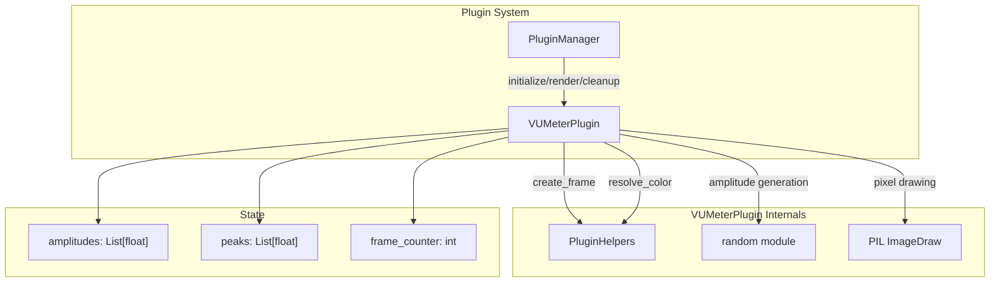
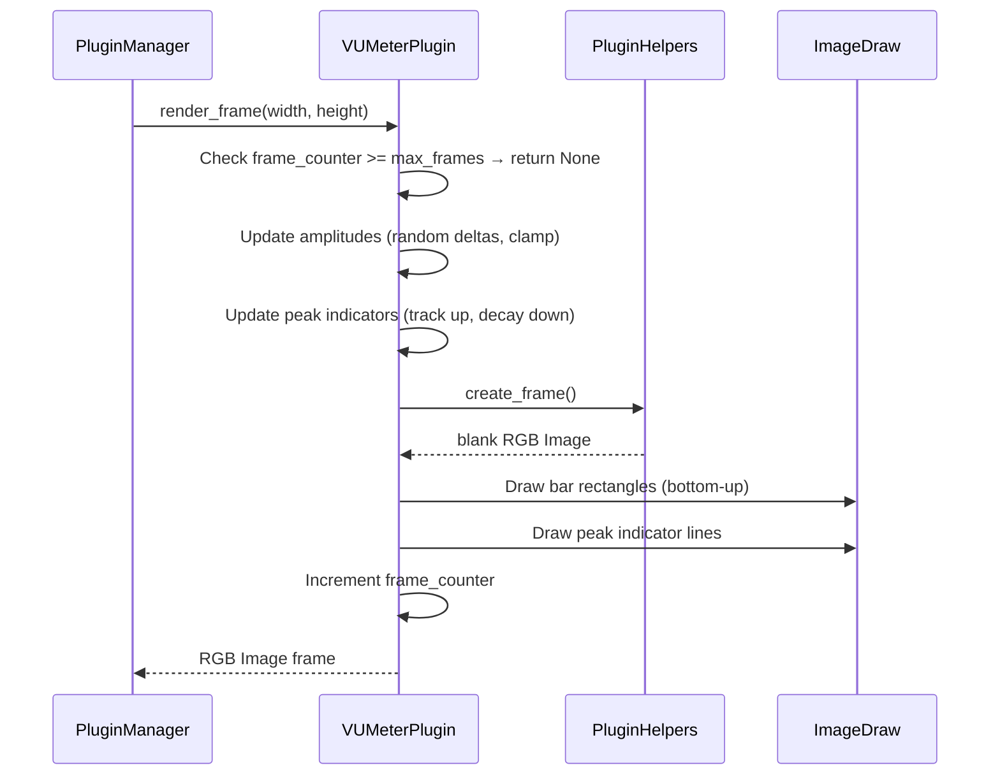
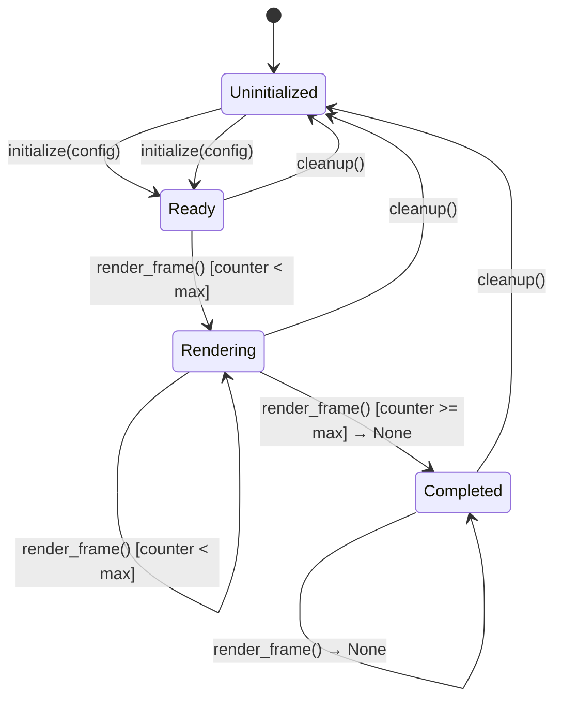

# Design Document: VU Meter Plugin

## Overview

The VU Meter Plugin (`vumeter`) is a zeClock attract-mode plugin that renders an animated audio VU meter visualization on the DMD display. It simulates frequency-band level meters with smooth, randomized amplitude changes creating a dynamic audio-themed animation. The plugin does not capture real audio — it generates synthetic amplitude data using Python's `random` module to drive vertical bar animations with floating peak indicators.

**Key Design Decisions:**
- Subclass `ClockPlugin` directly (not `PagedPlugin`) since VU meters are continuous frame-by-frame animations, not paged content.
- Use PIL `ImageDraw` for direct pixel manipulation rather than `PluginHelpers.render_text()`, since bars and peak indicators are geometric shapes, not text.
- Use `PluginHelpers.create_frame()` for blank frame creation to stay consistent with the plugin ecosystem.
- Use `PluginHelpers.resolve_color()` for named color resolution, leveraging the shared color palette.
- Generate synthetic amplitude via `random.uniform(-0.15, 0.15)` deltas per bar per frame, providing organic movement without requiring audio input.

## Architecture



**Render Loop Flow:**



## Components and Interfaces

### VUMeterPlugin Class

```python
class VUMeterPlugin(ClockPlugin):
    """Animated VU meter visualization plugin."""

    # Properties (constant)
    name: str = "vumeter"
    description: str = "Animated VU meter audio visualization"
    frame_delay_ms: int = 50  # 20 FPS

    # Instance state (set during initialize)
    _helpers: PluginHelpers
    _num_bars: int
    _duration_seconds: int
    _bar_color: Tuple[int, int, int]
    _peak_color: Tuple[int, int, int]
    _decay_rate: float
    _amplitudes: List[float]
    _peaks: List[float]
    _frame_counter: int
    _max_frames: int
    _completed: bool
```

### Interface with Plugin System

| Method | Input | Output | Behavior |
|--------|-------|--------|----------|
| `name` | — | `"vumeter"` | Fixed identity |
| `description` | — | String (1–256 chars) | Fixed description |
| `frame_delay_ms` | — | `50` | Fixed 20 FPS |
| `initialize(config)` | Config dict with `_helpers` + settings | `None` | Parse config, init state |
| `render_frame(width, height)` | Display dimensions | `Image` or `None` | Render one frame or signal done |
| `cleanup()` | — | `None` | Reset all state |

### Configuration Parameters

| Key | Type | Default | Range | Description |
|-----|------|---------|-------|-------------|
| `_helpers` | PluginHelpers | (required) | — | Injected rendering utilities |
| `num_bars` | int | 16 | [1, 64] | Number of vertical bars |
| `duration_seconds` | int | 10 | [1, 30] | Display duration |
| `color` | str | "green" | Any palette name | Bar fill color |
| `peak_color` | str | "red" | Any palette name | Peak indicator color |
| `decay_rate` | float | 0.05 | [0.01, 0.5] | Peak decay per frame |

### Bar Layout Algorithm

For a display of `width` pixels with `num_bars` bars and 1-pixel gaps:

```
bar_width = (width - (num_bars - 1)) // num_bars
bar_x[i] = i * (bar_width + 1)
```

If `bar_width < 1`, clamp to 1 and render only as many bars as fit.

### Bar Height Calculation

For a bar with amplitude `a` on a display of height `h`:

```
bar_pixel_height = int(a * h)
```

Bars grow upward from the bottom edge: filled from row `(height - 1)` up to row `(height - bar_pixel_height)`.

### Peak Indicator Position

Peak indicator y-coordinate on screen (0 = top):

```
peak_y = height - 1 - int(peak_position * (height - 1))
```

When `peak_position == 0.0`, the indicator renders at `y = height - 1` (bottom row).
When `peak_position == 1.0`, the indicator renders at `y = 0` (top row).

## Data Models

### Internal State

```python
@dataclass
class VUMeterState:
    """Internal state managed by the plugin."""
    amplitudes: List[float]      # Current amplitude per bar, [0.0, 1.0]
    peaks: List[float]           # Current peak position per bar, [0.0, 1.0]
    frame_counter: int           # Frames rendered this activation
    max_frames: int              # Total frames before completion
    completed: bool              # Whether None has been returned
```

### State Transitions



### Amplitude Update Algorithm (per frame)

```python
for i in range(num_bars):
    delta = random.uniform(-0.15, 0.15)
    amplitudes[i] = max(0.0, min(1.0, amplitudes[i] + delta))
    
    # Peak tracking
    if amplitudes[i] > peaks[i]:
        peaks[i] = amplitudes[i]
    else:
        peaks[i] = max(0.0, peaks[i] - decay_rate)
```

### Configuration Validation Logic

```python
def _clamp_config(value, default, min_val, max_val, numeric_type):
    if not isinstance(value, numeric_type):
        return default
    return max(min_val, min(max_val, value))
```

Applied to:
- `num_bars`: int, default=16, range=[1, 64]
- `duration_seconds`: int, default=10, range=[1, 30]
- `decay_rate`: float, default=0.05, range=[0.01, 0.5]

## Correctness Properties

*A property is a characteristic or behavior that should hold true across all valid executions of a system — essentially, a formal statement about what the system should do. Properties serve as the bridge between human-readable specifications and machine-verifiable correctness guarantees.*

### Property 1: Configuration clamping preserves valid range

*For any* numeric `num_bars` value, the stored value after initialization SHALL equal `max(1, min(64, num_bars))`. *For any* numeric `duration_seconds` value, the stored value SHALL equal `max(1, min(30, duration_seconds))`. *For any* numeric `decay_rate` value, the stored value SHALL equal `max(0.01, min(0.5, decay_rate))`. *For any* non-numeric value for these parameters, the stored value SHALL equal the respective default (16, 10, 0.05).

**Validates: Requirements 8.1, 8.2, 8.3, 8.4**

### Property 2: Initialization produces correctly sized arrays

*For any* valid `num_bars` value in [1, 64], after initialization the amplitudes array SHALL have length equal to `num_bars` and all elements SHALL be 0.0, and the peaks array SHALL have length equal to `num_bars` and all elements SHALL be 0.0.

**Validates: Requirements 2.7**

### Property 3: Frame output validity

*For any* valid `width` and `height` parameters passed to `render_frame()` while the plugin has not completed, the returned value SHALL be a PIL Image in RGB mode with dimensions exactly `(width, height)`, and all non-black pixels SHALL be within the image bounds `[0, width) x [0, height)`.

**Validates: Requirements 3.1, 6.2, 9.1, 9.2**

### Property 4: Bar height corresponds to amplitude

*For any* bar with amplitude `a` on a display of height `h`, the bar's filled pixel height SHALL equal `int(a * h)`, with pixels filled from the bottom edge (row `h-1`) upward.

**Validates: Requirements 3.2, 3.4, 9.4**

### Property 5: Bar layout positioning

*For any* valid `width` and `num_bars`, each bar SHALL have width `(width - (num_bars - 1)) // num_bars` (minimum 1), and bar `i` SHALL start at x-coordinate `i * (bar_width + 1)`.

**Validates: Requirements 3.3, 9.3, 9.5**

### Property 6: Peak tracks amplitude upward

*For any* bar where the new amplitude exceeds the current peak position, after the frame update the peak position SHALL equal the new amplitude.

**Validates: Requirements 4.1**

### Property 7: Peak decays toward amplitude

*For any* bar where the peak position is above the current amplitude, after one frame the peak position SHALL equal `max(0.0, old_peak - decay_rate)`.

**Validates: Requirements 4.2**

### Property 8: Peak indicator rendering position

*For any* bar with peak position `p` on a display of height `h`, the peak indicator SHALL be rendered as a 1-pixel-high horizontal line of width equal to the bar width, at y-coordinate `h - 1 - int(p * (h - 1))`.

**Validates: Requirements 4.3, 9.6**

### Property 9: Amplitude bounded changes and clamping

*For any* bar across consecutive frames, the amplitude change (before clamping) SHALL be within `[-0.15, +0.15]`, and the resulting amplitude SHALL always be within `[0.0, 1.0]`.

**Validates: Requirements 5.1, 5.2**

### Property 10: Per-bar amplitude independence

*For any* plugin state with `num_bars >= 2`, after rendering at least 3 frames, not all bar amplitudes SHALL be identical (confirming independent per-bar random generation).

**Validates: Requirements 5.3, 5.4**

### Property 11: Completion at max frame count

*For any* valid `duration_seconds` and `frame_delay_ms`, the plugin SHALL return a valid Image for exactly `int(duration_seconds * 1000 / frame_delay_ms)` calls to `render_frame()`, then return `None` on the next call.

**Validates: Requirements 6.1, 6.2, 6.3**

### Property 12: Completion is permanent (idempotence)

*For any* state where `render_frame()` has returned `None`, all subsequent calls to `render_frame()` SHALL also return `None`.

**Validates: Requirements 6.4**

### Property 13: Cleanup restores initial state

*For any* plugin state (regardless of how many frames were rendered), after `cleanup()` followed by `initialize()` with a valid config, the plugin SHALL have all amplitudes at 0.0, all peaks at 0.0, frame counter at 0, and be ready to produce frames as if freshly activated.

**Validates: Requirements 7.1, 7.2, 7.3, 7.5**

### Property 14: Cleanup idempotence

*For any* plugin state, calling `cleanup()` multiple times consecutively SHALL not raise an exception.

**Validates: Requirements 7.6**

### Property 15: Initialization robustness under invalid config

*For any* config dict containing a valid `_helpers` key (but arbitrary invalid values for other keys), `initialize()` SHALL complete without raising an exception.

**Validates: Requirements 8.7**

## Error Handling

| Scenario | Behavior | Rationale |
|----------|----------|-----------|
| Missing `_helpers` in config | Raise exception (KeyError or similar) | Plugin cannot render without helpers; Plugin_System marks as failed (Req 2.10) |
| Non-numeric config values | Use default values | Graceful degradation (Req 8.4) |
| Out-of-range config values | Clamp to valid range | Prevents invalid state (Req 8.1–8.3) |
| Invalid color name | `resolve_color` returns fallback | PluginHelpers handles this with default param (Req 8.5–8.6) |
| `render_frame` after completion | Return `None` | Idempotent completion (Req 6.4) |
| Exception in cleanup | Catch and suppress | Never propagate errors to Plugin_System (Req 7.4) |
| Very large `num_bars` (> width) | Clamp bar_width to 1px, limit visible bars | Prevents zero-width bars (Req 3.7) |

**Error handling strategy:** The plugin is defensive in initialization (catch type errors, use defaults, clamp values) and conservative in cleanup (try/except around all state resets). During rendering, no external I/O occurs, so failures would only come from PIL operations, which are not expected to fail for valid in-memory image operations.

## Testing Strategy

### Property-Based Tests (Hypothesis)

The plugin's core logic (config clamping, amplitude updates, peak tracking, bar rendering, completion signaling) involves pure computations with clear input/output behavior, making it well-suited for property-based testing.

**Library:** [Hypothesis](https://hypothesis.readthedocs.io/) for Python property-based testing.

**Configuration:** Each property test runs a minimum of 100 iterations using `@settings(max_examples=100)`.

**Tag format:** Each test is tagged with a comment: `# Feature: vumeter-plugin, Property {N}: {title}`

Properties to implement as property-based tests:
- Property 1: Config clamping (generate random numeric/non-numeric values)
- Property 2: Array initialization sizing (generate random num_bars in [1, 64])
- Property 3: Frame output validity (generate random width/height combinations)
- Property 4: Bar height rendering (generate random amplitudes and heights)
- Property 5: Bar layout positioning (generate random width/num_bars combinations)
- Property 6: Peak tracks amplitude upward (generate amplitude > peak scenarios)
- Property 7: Peak decays (generate peak > amplitude scenarios with random decay rates)
- Property 9: Amplitude bounded changes (run multiple frames, verify bounds)
- Property 10: Per-bar independence (run 3+ frames, verify divergence)
- Property 11: Completion timing (generate random duration_seconds values)
- Property 12: Completion idempotence (after None, subsequent calls return None)
- Property 13: Cleanup restores state (run plugin, cleanup, verify fresh state)
- Property 14: Cleanup idempotence (call cleanup N times, no exception)
- Property 15: Initialization robustness (generate random invalid configs)

### Unit Tests (pytest)

Unit tests cover specific examples, edge cases, and integration points:

- Plugin identity: `name == "vumeter"`, description within bounds, `frame_delay_ms == 50`
- Property stability: multiple accesses return same values
- Missing `_helpers` raises exception
- Peak indicator at position 0.0 renders at bottom row
- Bar width minimum of 1px when num_bars > width
- Color resolution with invalid names falls back correctly
- Completion within 2-second timeout per frame (smoke test)
- HD resolution (256x64) renders correctly

### Test Infrastructure

- **Fixtures:** Mock `PluginHelpers` using `tmp_path` for resources directory (matching existing test patterns in `tests/conftest.py`)
- **Async support:** `pytest-asyncio` for testing async `initialize()`, `render_frame()`, and `cleanup()` methods
- **Pixel inspection:** Direct PIL `Image.getpixel()` / `Image.load()` for verifying bar and peak indicator positions
- **Random seeding:** Use `random.seed()` in specific tests where deterministic output is needed for verification
