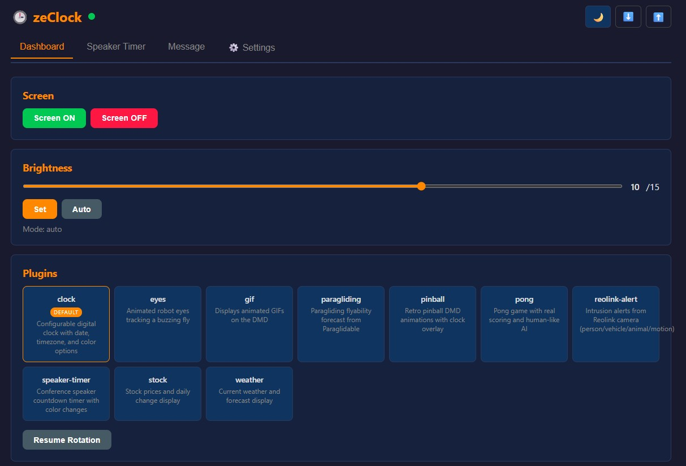
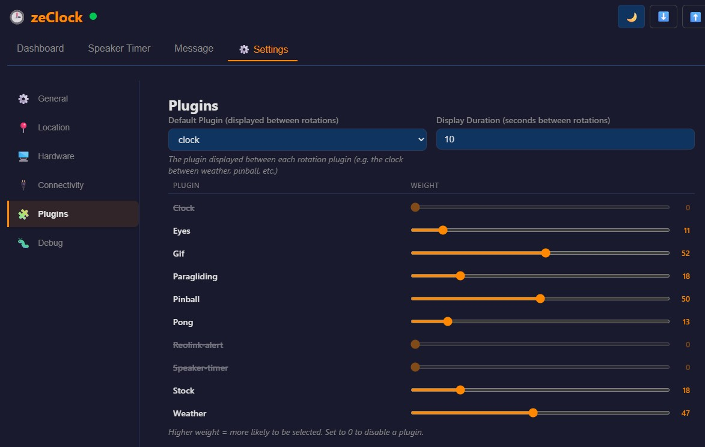
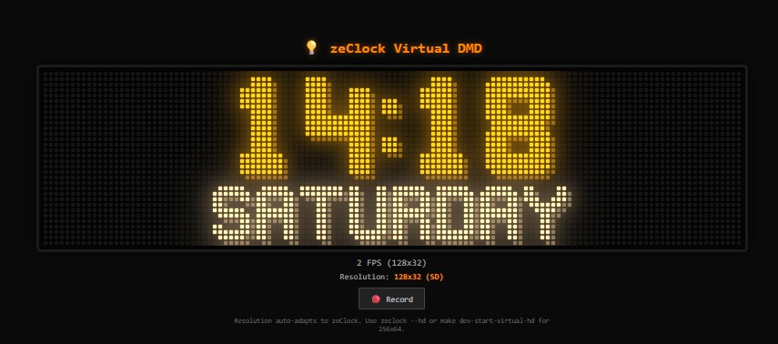
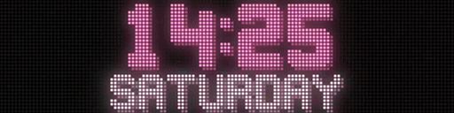

# zeClock

> 🕒 A smart DMD clock with a plugin system, for [ZeDMD](https://github.com/PPUC/ZeDMD), [Pixelcade](https://pixelcade.org/), and [PIN2DMD](https://pin2dmd.com/) displays.

Tired of simple DMD clocks that only show time and maybe a GIF? zeClock is a full-featured DMD clock with built-in plugins (pinball animations, weather, stocks, pong, speaker timer and more), a plugin system to create your own, and connectivity to your ecosystem via REST API, MQTT, and Home Assistant.

zeClock can drive ZeDMD hardware directly via `libzedmd`, or output to **any device supported by [libdmdutil](https://github.com/vpinball/libdmdutil)'s `dmdserver`** -- including ZeDMD, Pixelcade, and PIN2DMD -- with multiple devices active simultaneously.

It comes with a **web interface** for easy configuration, and a **browser-based virtual renderer** so you can try everything before buying [ZeDMD-compatible hardware](https://github.com/PPUC/ZeDMD#which-led-panels-are-lcd-screens-are-supported).

For an autonomous setup, install zeClock on a **Raspberry Pi** - ZeDMD is auto-detected via USB or WiFi. Just power the Pi and get going with a 24/7 clock.


Full length video: [📺 www.youtube.com/watch?v=YdpWlg71KtM](https://www.youtube.com/watch?v=YdpWlg71KtM)

You can configure zeClock through configuration files or a dedicated web UI.



And also configure how often a given plugin will appear, and even de-activate it.



## Quick Start

**No hardware required** — try zeClock in your browser in seconds:

```bash
git clone https://github.com/DMDTools/zeClock.git
cd zeClock
pip install -e ".[dev]"
zeclock --bootstrap
make dev-start-virtual
```

Open **http://localhost:3000** — the clock is running with a WebGL DMD shader in your browser!



For HD mode (256x64): `make dev-start-virtual-hd` · To stop: `make dev-stop` or `Ctrl+C`

## Plugins

zeClock alternates between a clock display and animated plugins. Each plugin renders content on the DMD for a few seconds, then returns to the clock.

### Pinball

Retro pinball DMD animations with clock overlay. Plays randomly from 2300+ `.scn` animation files with DotBlt composition. Powered by [DotClk-Resources](https://github.com/sigmafx/DotClk-Resources), kindly shared by [SigmaFX](https://github.com/sigmafx) with authorization to use the proprietary `.scn` animations.


### Pong

Two AI players compete in a real Pong match. The score persists across activations — the clock only takes over between points. First to 5 wins with confetti celebration.


### Weather

Current conditions, tomorrow's forecast, 3-day outlook, and 7-day overview. Data from Open-Meteo API (no key required), cached 15 minutes.


### Eyes

Animated robot eyes tracking a buzzing fly. The eyes react with expressions (surprised, annoyed, sleepy) based on the fly's behavior.


### Stock

Real-time stock prices from Yahoo Finance with intraday sparkline graphs. Supports multiple symbols, pre/post market data.


### GIF

Plays animated GIFs with support for multiple source directories and weighted random rotation. Drop `.gif` files in `~/.zeclock/plugins/gif/` or configure multiple directories.

A great source: [11,000+ DMD GIF pack](https://www.neo-arcadia.com/forum/viewtopic.php?t=67065) (donationware, with a free 600 GIF pack available at the same link).


### Speaker Timer

Conference countdown timer visible from stage. Control via Web UI or REST API: set duration, start, pause, reset. The progress bar transitions from green → orange (20% remaining) → red (10% remaining), then blinks at 00:00 when elapsed.

You can also send messages to the display at any time through the Web UI or API (e.g. "WRAP UP!", "5 min remaining!").


### Paragliding

AI-based paragliding flyability forecast from [Paraglidable](https://paraglidable.com/). Cycles through configured spots showing today's FLY/XC/Takeoff percentages (color-coded: green ≥80%, orange ≥60%, red <60%), plus a 3-day forecast page per spot. Data cached 30 minutes. Requires a free API key.


### Reolink Alert

Real-time intrusion detection alerts from [Reolink](https://www.reolink.com/) cameras. Connects via the [Baichuan TCP push protocol](https://github.com/starkillerOG/reolink_aio) for instant event delivery — no polling. Displays a localized blinking alert when a person, vehicle, animal, or motion is detected:

- 🔴 **Person** — red blinking border
- 🟠 **Vehicle** — orange blinking border
- 🟢 **Animal** — green blinking border
- 🟡 **Motion** — yellow blinking border

Messages are localized (en/fr/de/es) via the global `language` setting. The alert overrides whatever is currently displayed and disappears after a configurable duration.



## Plugin Configuration

Plugins are configured in `~/.zeclock/config/plugins.yaml`:

```yaml
language: fr
clock_display_seconds: 10
plugins:
  - name: pinball
    frequency: 30
  - name: pong
    frequency: 20
  - name: weather
    frequency: 20
    settings:
      city_name: Grenoble
      latitude: 45.19
      longitude: 5.72
  - name: eyes
    frequency: 10
  - name: stock
    frequency: 10
    settings:
      symbols: AAPL,MSFT,^FCHI
      page_duration_seconds: 5
  - name: gif
    frequency: 15
    settings:
      gif_dirs:
        - path: "~/.zeclock/plugins/gif/Arcade"
          weight: 30
          recursive: true
        - path: "~/.zeclock/plugins/gif/Movies"
          weight: 10
          recursive: false
  - name: speaker-timer
    frequency: 0
    settings:
      yellow_threshold: 20
      red_threshold: 10
  - name: paragliding
    frequency: 15
    settings:
      api_key: YOUR_PARAGLIDABLE_API_KEY
      # Optional: filter to specific spots (comma-separated substrings)
      # spots: "St Hilaire,Chamrousse"
      page_duration_seconds: 5
```

- **language**: Global language for the UI and all plugins (en, fr, de, es)
- **clock_display_seconds**: How long the clock is shown between plugins (default: 5)
- **frequency**: Relative weight for plugin selection (higher = more often). Set to 0 to disable a plugin without removing it.

Override from CLI: `zeclock --plugins pinball,pong`

## Create Your Own Plugin

zeClock's plugin system is designed for extensibility. Create a single Python file, drop it in `~/.zeclock/plugins/`, and it's automatically discovered at startup.

A minimal plugin is ~30 lines of code:

```python
from PIL import Image
from zeclock.plugins.base import ClockPlugin

class MyPlugin(ClockPlugin):
    @property
    def name(self) -> str:
        return "my-plugin"

    @property
    def description(self) -> str:
        return "My custom plugin"

    @property
    def frame_delay_ms(self) -> int:
        return 100  # 10 FPS

    async def initialize(self, config: dict) -> None:
        pass

    async def render_frame(self, width: int, height: int):
        img = Image.new("RGB", (width, height), (0, 0, 0))
        # Draw your content on img using Pillow
        return img

    async def cleanup(self) -> None:
        pass
```

The full guide covers multi-page plugins, config schemas (auto-generated web UI forms), confetti animations, upscaling helpers, error handling, and testing:

👉 **[Plugin Authoring Guide](docs/plugin_authoring.md)**

### Per-Plugin Settings

| Plugin | Setting | Description |
|--------|---------|-------------|
| **weather** | `city_name` | City name (triggers geocoding if no lat/lon) |
| | `latitude` / `longitude` | Coordinates for weather data |
| | `temperature_unit` | `celsius` (default) or `fahrenheit` |
| | `page_duration_seconds` | Duration per weather page (default: 4) |
| **stock** | `symbols` | Comma-separated tickers (e.g. `AAPL,MSFT,^FCHI`) |
| | `page_duration_seconds` | Duration per stock page (default: 5) |
| **gif** | `gif_dirs` | List of directory entries (see example above) |
| | Each entry: `path` | Directory containing `.gif` files (required) |
| | `weight` | Selection probability (default: 50) |
| | `recursive` | Search subdirectories (default: true) |
| **speaker-timer** | `yellow_threshold` | % remaining to switch to orange (default: 20) |
| | `red_threshold` | % remaining to switch to red (default: 10) |
| **pinball** | `color` | Animation color name (default: `orange`) |
| | `animation_color` | Separate animation color (default: complementary of `color`) |
| **pong** | `color` | Game color name (default: `orange`) |
| **eyes** | `color` | Eyes color name (default: `cyan`) |
| **paragliding** | `api_key` | Paraglidable API key (required, free from paraglidable.com) |
| | `spots` | Comma-separated spot name filters (optional) |
| | `page_duration_seconds` | Duration per page (default: 5) |
| **reolink-alert** | `camera_host` | IP address or hostname of the Reolink camera (required) |
| | `camera_user` | Camera login username (default: `admin`) |
| | `camera_password` | Camera login password (required) |
| | `camera_channel` | Camera channel, 0 for single cam (default: 0) |
| | `alert_duration` | Display duration in seconds (default: 15) |
| | `cooldown_seconds` | Minimum time between alerts (default: 10) |


## Installation

### Option A: Global Isolated Install (pipx / uvx)

```bash
# With pipx:
pipx install git+https://github.com/DMDTools/zeClock.git

# OR with uvx (no install needed):
uvx --from git+https://github.com/DMDTools/zeClock.git zeclock
```

### Option B: Development Install (Source)

```bash
git clone https://github.com/DMDTools/zeClock.git
cd zeClock
pip install -e ".[dev]"
```

### Bootstrap

On first launch, zeClock downloads resources automatically. Or run manually:

```bash
zeclock --bootstrap
```

This installs to `~/.zeclock/`:
- **libzedmd** — native ZeDMD communication library
- **2300+ retro animations** (`.scn`) and bitmap fonts (`.fnt`) from [DotClk-Resources](https://github.com/sigmafx/DotClk-Resources)

## Usage

### With ZeDMD hardware

```bash
# Auto-detect backend and connection
zeclock

# Fixed orange clock
zeclock --color orange

# Only specific plugins
zeclock --plugins pinball,weather
```

### CLI Options

| Option | Values | Default | Description |
|--------|--------|---------|-------------|
| `--backend` | `auto`, `zedmd`, `dmdserver` | `auto` | Backend selection ([details](docs/backends.md)) |
| `--wifi-addr` | IP address | from config | ZeDMD WiFi address |
| `--device` | path | auto-detect | USB serial device |
| `--brightness` | 0-15 | 10 | Display brightness |
| `--hd` | — | — | Force HD resolution (256x64) |
| `--color` | color name | `auto` | Clock color (auto = rotate every minute) |
| `--plugins` | comma-separated | all | Only activate listed plugins |
| `--bootstrap` | — | — | Install resources |

### Configuration File

`~/.zeclock/config/zeclock.ini`:

```ini
[zedmd]
wifi_addr = 192.168.0.35
brightness = 10

[display]
font = STANDARD

[location]
# Used by brightness scheduling (sunrise/sunset auto-brightness)
# Note: the weather plugin has its own location in plugins.yaml
latitude = 45.1885
longitude = 5.7245
city_name = Grenoble

[brightness_schedule]
max_brightness = 7
default = 22:00-08:00 10%
sunrise_brightness = 100%
sunset_brightness = 10%
# time_only = 22:00-08:00

[rest_api]
enabled = true
host = 0.0.0.0
port = 8080

[dmdserver]
host = localhost
port = 6789
```

### Brightness Scheduling

Brightness is percentage-based (0–100%). 100% maps to `max_brightness` hardware level.

```ini
[brightness_schedule]
# Per-day (overnight ranges supported)
default = 22:00-08:00 10%
monday = 08:00-18:00 80%, 22:00-08:00 10%

# Or sunrise/sunset auto (requires [location])
sunrise_brightness = 100%
sunset_brightness = 10%

# "Time only" mode: clock only, no plugins during these hours
time_only = 22:00-08:00
```

## Remote Control (REST API & MQTT)

### REST API

Enable in config, then control via HTTP:

| Method | Endpoint | Description |
|--------|----------|-------------|
| `GET` | `/api/status` | Current status |
| `POST` | `/api/screen/on` | Turn screen on |
| `POST` | `/api/screen/off` | Turn screen off |
| `POST` | `/api/plugin/force` | Force plugin `{"plugin": "name"}` |
| `POST` | `/api/plugin/resume` | Resume normal rotation |
| `POST` | `/api/text` | Display text `{"text": "...", "duration": 10}` |
| `POST` | `/api/alert` | Rich alert with blinking border `{"text": "...", "duration": 15, "icon": "person", "color": [255,0,0]}` |
| `POST` | `/api/speaker-timer/set` | Set timer `{"seconds": 300}` |
| `POST` | `/api/speaker-timer/start` | Start/resume timer |
| `POST` | `/api/speaker-timer/pause` | Pause timer |
| `POST` | `/api/speaker-timer/reset` | Reset timer |

### MQTT

```ini
[mqtt]
enabled = true
host = 192.168.1.100
port = 1883
device_id = zeclock
ha_discovery = true
```

Install: `pip install zeclock[mqtt]`

Topics: `zeclock/<device_id>/command`, `zeclock/<device_id>/state`, `zeclock/<device_id>/availability`

When `ha_discovery = true`, zeClock auto-registers in Home Assistant (switch + sensors).

## Two Operating Modes

### 🖥️ Local Development (PC / Mac)

ZeDMD hardware optional — browser emulation at `http://localhost:3000`.

### 🍓 Autonomous (Raspberry Pi)

Plug in a Raspberry Pi, power on — zeClock auto-detects ZeDMD (USB or WiFi) and runs 24/7 unattended.

#### What You Need

- Raspberry Pi 4 (or 5) with WiFi
- microSD card (8 GB+)
- ZeDMD display (USB or WiFi — auto-detected)
- Power supply for the Pi and ZeDMD

#### Step 1 — Flash the SD Card

Download the latest `zeclock-rpi.img.xz` from [GitHub Releases](https://github.com/DMDTools/zeClock/releases).

Flash it with [Raspberry Pi Imager](https://www.raspberrypi.com/software/), [balenaEtcher](https://etcher.balena.io/), or from the command line:

```bash
xzcat zeclock-rpi.img.xz | sudo dd of=/dev/sdX bs=4M status=progress
sync
```

#### Step 2 — Connect and Power On

1. Insert the SD card into the Pi
2. Plug ZeDMD into a USB port on the Pi
3. Power on the Pi

#### Step 3 — Connect to WiFi

On first boot, the Pi doesn't know your WiFi yet. After ~30 seconds it creates its own hotspot:

1. On your phone or laptop, connect to the WiFi network **zeClock-Setup**
2. A captive portal opens automatically — select your home WiFi and enter the password
3. The Pi connects, and zeClock starts within seconds

That's it! WiFi credentials are saved — next time you power on, it connects automatically.

#### Step 4 — Enjoy

The clock is running. The display survives power cuts — just unplug/replug anytime.

#### Changing Settings

The web UI is available at **http://zeclock.local:8080** (REST API enabled by default).

You can also SSH in:

```bash
ssh zeclock@zeclock.local
# Default password: zeclock
```

Configuration lives in `/data/zeclock/config/`:

```bash
nano /data/zeclock/config/zeclock.ini    # display, brightness, backend
nano /data/zeclock/config/plugins.yaml   # plugins and their settings
sudo systemctl restart zeclock           # apply changes
```

#### Building the Image Yourself

The image is built automatically via GitHub Actions on a native ARM64 runner (~2 min). See the [Releases page](https://github.com/DMDTools/zeClock/releases).

To add your GIF collection to the image locally (WSL2 or Linux):

```bash
make rpi-inject-gifs   # Downloads CI image + injects GIFs from ~/.zeclock/plugins/gif
```

See [`deploy/rpi/`](deploy/rpi/) for the full Packer build system and architecture details.

## Development

```bash
make test              # Run tests + lint + type check
make dev-start-virtual # Virtual DMD in browser (128x32)
make dev-start-virtual-hd  # Virtual DMD HD (256x64)
```

See [CONTRIBUTING.md](CONTRIBUTING.md) for full details.

## Troubleshooting

**libzedmd not found** — Run `zeclock --bootstrap` to install.

**ZeDMD not detected (WiFi)** — Check `ping <ip>` and set `wifi_addr` in config or via `--wifi-addr`.

**ZeDMD not detected (USB)** — List ports with `ls /dev/ttyUSB*` and use `--device`.

**Animations not displaying** — Run `zeclock --bootstrap` to reinstall resources.

## References

- [sigmafx/DotClk](https://github.com/sigmafx/DotClk) — Original DotClk inspiration
- [sigmafx/DotClk-Resources](https://github.com/sigmafx/DotClk-Resources) — 2300+ animations
- [PPUC/libzedmd](https://github.com/PPUC/libzedmd) — ZeDMD native library
- [PPUC/ZeDMD](https://github.com/PPUC/ZeDMD) — ZeDMD hardware
- [vpinball/libdmdutil](https://github.com/vpinball/libdmdutil) — DMD utility library with `dmdserver` for multi-device output (ZeDMD, Pixelcade, PIN2DMD)

## License

MIT — see [LICENSE](LICENSE)

---

**Made with ❤️ by ojacques — Inspired by the magic of retro pinball** 🎮✨
