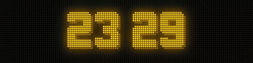
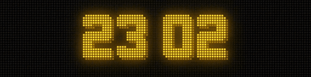
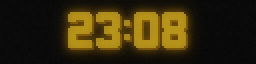
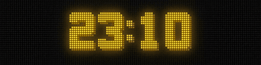
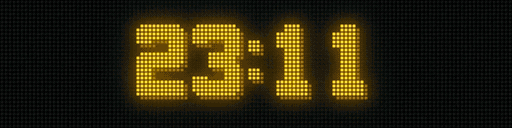
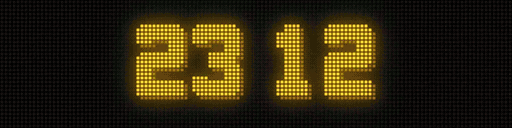
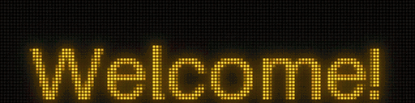
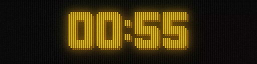

# zeClock

> 🕒 A smart DMD clock with a plugin system, for [ZeDMD](https://github.com/PPUC/ZeDMD) compatible hardware

Tired of simple DMD clocks that only show time and maybe a GIF? zeClock is a full-featured DMD clock with built-in plugins (pinball animations, weather, stocks, pong, speaker timer and more), a plugin system to create your own, and connectivity to your ecosystem via REST API, MQTT, and Home Assistant.

It comes with a **web interface** for easy configuration, and a **browser-based virtual renderer** so you can try everything before buying [ZeDMD-compatible hardware](https://github.com/PPUC/ZeDMD#which-led-panels-are-lcd-screens-are-supported).

For an autonomous setup, install zeClock on a **Raspberry Pi** connected to ZeDMD via USB — just power the Pi and get going with a 24/7 clock.



## Quick Start

**No hardware required** — try zeClock in your browser in seconds:

```bash
git clone https://github.com/DMDTools/zeClock.git
cd zeClock
pip install -e ".[dev]"
zeclock --bootstrap
make dev-start-virtual
```

Open **http://localhost:3000** — the clock is running with a WebGL DMD shader in your browser!

For HD mode (256x64): `make dev-start-virtual-hd` · To stop: `make dev-stop` or `Ctrl+C`

## Plugins

zeClock alternates between a clock display and animated plugins. Each plugin renders content on the DMD for a few seconds, then returns to the clock.

### Pinball

Retro pinball DMD animations with clock overlay. Plays randomly from 2300+ `.scn` animation files with DotBlt composition. Powered by [DotClk-Resources](https://github.com/sigmafx/DotClk-Resources), kindly shared by [SigmaFX](https://github.com/sigmafx) with authorization to use the proprietary `.scn` animations.



### Pong

Two AI players compete in a real Pong match. The score persists across activations — the clock only takes over between points. First to 5 wins with confetti celebration.



### Weather

Current conditions, tomorrow's forecast, 3-day outlook, and 7-day overview. Data from Open-Meteo API (no key required), cached 15 minutes.



### Eyes

Animated robot eyes tracking a buzzing fly. The eyes react with expressions (surprised, annoyed, sleepy) based on the fly's behavior.



### Stock

Real-time stock prices from Yahoo Finance with intraday sparkline graphs. Supports multiple symbols, pre/post market data.



### GIF

Plays animated GIFs with support for multiple source directories and weighted random rotation. Drop `.gif` files in `~/.zeclock/plugins/gif/` or configure multiple directories.

A great source: [11,000+ DMD GIF pack](https://www.neo-arcadia.com/forum/viewtopic.php?t=67065) (donationware, with a free 600 GIF pack available at the same link).


### Speaker Timer

Conference countdown timer visible from stage. Control via Web UI or REST API: set duration, start, pause, reset. The progress bar transitions from green → orange (20% remaining) → red (10% remaining), then blinks at 00:00 when elapsed.

You can also send messages to the display at any time through the Web UI or API (e.g. "WRAP UP!", "5 min remaining!").



### Paragliding

AI-based paragliding flyability forecast from [Paraglidable](https://paraglidable.com/). Cycles through configured spots showing today's FLY/XC/Takeoff percentages (color-coded: green ≥80%, orange ≥60%, red <60%), plus a 3-day forecast page per spot. Data cached 30 minutes. Requires a free API key.



## Plugin Configuration

Plugins are configured in `~/.zeclock/config/plugins.yaml`:

```yaml
clock_display_seconds: 10
plugins:
  - name: pinball
    frequency: 30
  - name: pong
    frequency: 20
  - name: weather
    frequency: 20
    settings:
      city_name: Grenoble
      latitude: 45.19
      longitude: 5.72
      language: fr
  - name: eyes
    frequency: 10
  - name: stock
    frequency: 10
    settings:
      symbols: AAPL,MSFT,^FCHI
      page_duration_seconds: 5
  - name: gif
    frequency: 15
    settings:
      gif_dirs:
        - path: "~/.zeclock/plugins/gif/Arcade"
          weight: 30
          recursive: true
        - path: "~/.zeclock/plugins/gif/Movies"
          weight: 10
          recursive: false
  - name: speaker-timer
    frequency: 0
    settings:
      yellow_threshold: 20
      red_threshold: 10
  - name: paragliding
    frequency: 15
    settings:
      api_key: YOUR_PARAGLIDABLE_API_KEY
      language: fr
      # Optional: filter to specific spots (comma-separated substrings)
      # spots: "St Hilaire,Chamrousse"
      page_duration_seconds: 5
```

- **clock_display_seconds**: How long the clock is shown between plugins (default: 5)
- **frequency**: Relative probability of selecting each plugin (higher = more often). Set to 0 for plugins activated only via API (like speaker-timer).

Override from CLI: `zeclock --plugins pinball,pong`

### Per-Plugin Settings

| Plugin | Setting | Description |
|--------|---------|-------------|
| **weather** | `city_name` | City name (triggers geocoding if no lat/lon) |
| | `latitude` / `longitude` | Coordinates for weather data |
| | `language` | Language for conditions (e.g. `fr`, `en`) |
| | `temperature_unit` | `celsius` (default) or `fahrenheit` |
| | `page_duration_seconds` | Duration per weather page (default: 4) |
| **stock** | `symbols` | Comma-separated tickers (e.g. `AAPL,MSFT,^FCHI`) |
| | `page_duration_seconds` | Duration per stock page (default: 5) |
| **gif** | `gif_dirs` | List of directory entries (see example above) |
| | Each entry: `path` | Directory containing `.gif` files (required) |
| | `weight` | Selection probability (default: 50) |
| | `recursive` | Search subdirectories (default: true) |
| **speaker-timer** | `yellow_threshold` | % remaining to switch to orange (default: 20) |
| | `red_threshold` | % remaining to switch to red (default: 10) |
| **pinball** | — | No settings (uses clock color automatically) |
| **pong** | — | No settings |
| **eyes** | — | No settings |
| **paragliding** | `api_key` | Paraglidable API key (required, free from paraglidable.com) |
| | `language` | `en` or `fr` (default: `en`) |
| | `spots` | Comma-separated spot name filters (optional) |
| | `page_duration_seconds` | Duration per page (default: 5) |


## Installation

### Option A: Global Isolated Install (pipx / uvx)

```bash
# With pipx:
pipx install git+https://github.com/DMDTools/zeClock.git

# OR with uvx (no install needed):
uvx --from git+https://github.com/DMDTools/zeClock.git zeclock
```

### Option B: Development Install (Source)

```bash
git clone https://github.com/DMDTools/zeClock.git
cd zeClock
pip install -e ".[dev]"
```

### Bootstrap

On first launch, zeClock downloads resources automatically. Or run manually:

```bash
zeclock --bootstrap
```

This installs to `~/.zeclock/`:
- **libzedmd** — native ZeDMD communication library
- **2300+ retro animations** (`.scn`) and bitmap fonts (`.fnt`) from [DotClk-Resources](https://github.com/sigmafx/DotClk-Resources)

## Usage

### With ZeDMD hardware

```bash
# Auto-detect backend and connection
zeclock

# Fixed orange clock
zeclock --color orange

# Orange clock with blue animations
zeclock --color orange --animation-color blue

# Only specific plugins
zeclock --plugins pinball,weather
```

### CLI Options

| Option | Values | Default | Description |
|--------|--------|---------|-------------|
| `--backend` | `auto`, `zedmd`, `dmdserver` | `auto` | Backend selection |
| `--wifi-addr` | IP address | from config | ZeDMD WiFi address |
| `--device` | path | auto-detect | USB serial device |
| `--brightness` | 0-15 | 10 | Display brightness |
| `--hd` | — | — | Force HD resolution (256x64) |
| `--color` | color name | `auto` | Clock color (auto = rotate every minute) |
| `--animation-color` | color name | same as clock | Animation color |
| `--plugins` | comma-separated | all | Only activate listed plugins |
| `--bootstrap` | — | — | Install resources |

### Configuration File

`~/.zeclock/config/zeclock.ini`:

```ini
[zedmd]
wifi_addr = 192.168.0.35
brightness = 10

[display]
font = STANDARD

[location]
# Used by brightness scheduling (sunrise/sunset auto-brightness)
# Note: the weather plugin has its own location in plugins.yaml
latitude = 45.1885
longitude = 5.7245
city_name = Grenoble

[brightness_schedule]
max_brightness = 7
default = 22:00-08:00 10%
sunrise_brightness = 100%
sunset_brightness = 10%
# time_only = 22:00-08:00

[rest_api]
enabled = true
host = 0.0.0.0
port = 8080

[dmdserver]
host = localhost
port = 6789
```

### Brightness Scheduling

Brightness is percentage-based (0–100%). 100% maps to `max_brightness` hardware level.

```ini
[brightness_schedule]
# Per-day (overnight ranges supported)
default = 22:00-08:00 10%
monday = 08:00-18:00 80%, 22:00-08:00 10%

# Or sunrise/sunset auto (requires [location])
sunrise_brightness = 100%
sunset_brightness = 10%

# "Time only" mode: clock only, no plugins during these hours
time_only = 22:00-08:00
```

## Remote Control (REST API & MQTT)

### REST API

Enable in config, then control via HTTP:

| Method | Endpoint | Description |
|--------|----------|-------------|
| `GET` | `/api/status` | Current status |
| `POST` | `/api/screen/on` | Turn screen on |
| `POST` | `/api/screen/off` | Turn screen off |
| `POST` | `/api/plugin/force` | Force plugin `{"plugin": "name"}` |
| `POST` | `/api/plugin/resume` | Resume normal rotation |
| `POST` | `/api/text` | Display text `{"text": "...", "duration": 10}` |
| `POST` | `/api/speaker-timer/set` | Set timer `{"seconds": 300}` |
| `POST` | `/api/speaker-timer/start` | Start/resume timer |
| `POST` | `/api/speaker-timer/pause` | Pause timer |
| `POST` | `/api/speaker-timer/reset` | Reset timer |

### MQTT

```ini
[mqtt]
enabled = true
host = 192.168.1.100
port = 1883
device_id = zeclock
ha_discovery = true
```

Install: `pip install zeclock[mqtt]`

Topics: `zeclock/<device_id>/command`, `zeclock/<device_id>/state`, `zeclock/<device_id>/availability`

When `ha_discovery = true`, zeClock auto-registers in Home Assistant (switch + sensors).

## Two Operating Modes

### 🖥️ Local Development (PC / Mac)

ZeDMD hardware optional — browser emulation at `http://localhost:3000`.

### 🍓 Autonomous (Raspberry Pi)

24/7 unattended with read-only filesystem, WiFi auto-connect, systemd service. See [`deploy/rpi/`](deploy/rpi/).

## Development

```bash
make test              # Run tests + lint + type check
make dev-start-virtual # Virtual DMD in browser (128x32)
make dev-start-virtual-hd  # Virtual DMD HD (256x64)
```

See [CONTRIBUTING.md](CONTRIBUTING.md) for full details.

## Troubleshooting

**libzedmd not found** — Run `zeclock --bootstrap` to install.

**ZeDMD not detected (WiFi)** — Check `ping <ip>` and set `wifi_addr` in config or via `--wifi-addr`.

**ZeDMD not detected (USB)** — List ports with `ls /dev/ttyUSB*` and use `--device`.

**Animations not displaying** — Run `zeclock --bootstrap` to reinstall resources.

## References

- [sigmafx/DotClk](https://github.com/sigmafx/DotClk) — Original DotClk inspiration
- [sigmafx/DotClk-Resources](https://github.com/sigmafx/DotClk-Resources) — 2300+ animations
- [PPUC/libzedmd](https://github.com/PPUC/libzedmd) — ZeDMD native library
- [PPUC/ZeDMD](https://github.com/PPUC/ZeDMD) — ZeDMD hardware

## License

MIT — see [LICENSE](LICENSE)

---

**Made with ❤️ by ojacques — Inspired by the magic of retro pinball** 🎮✨
