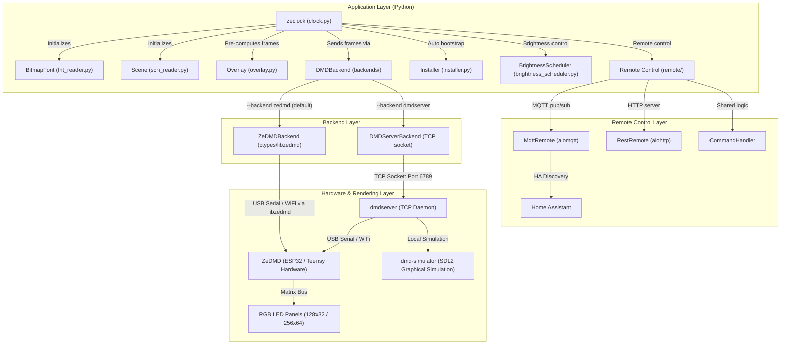
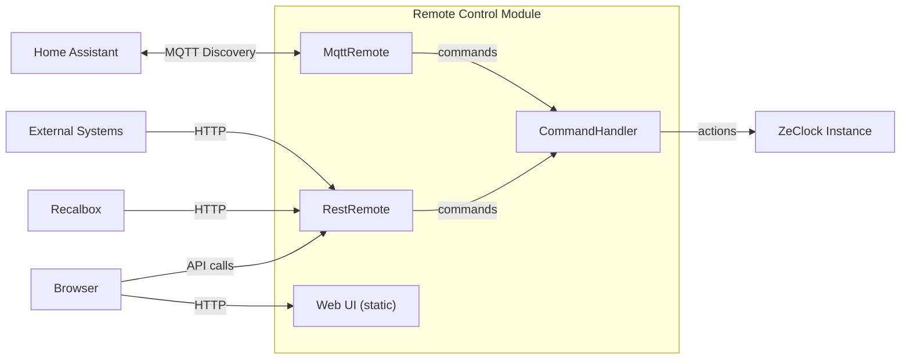
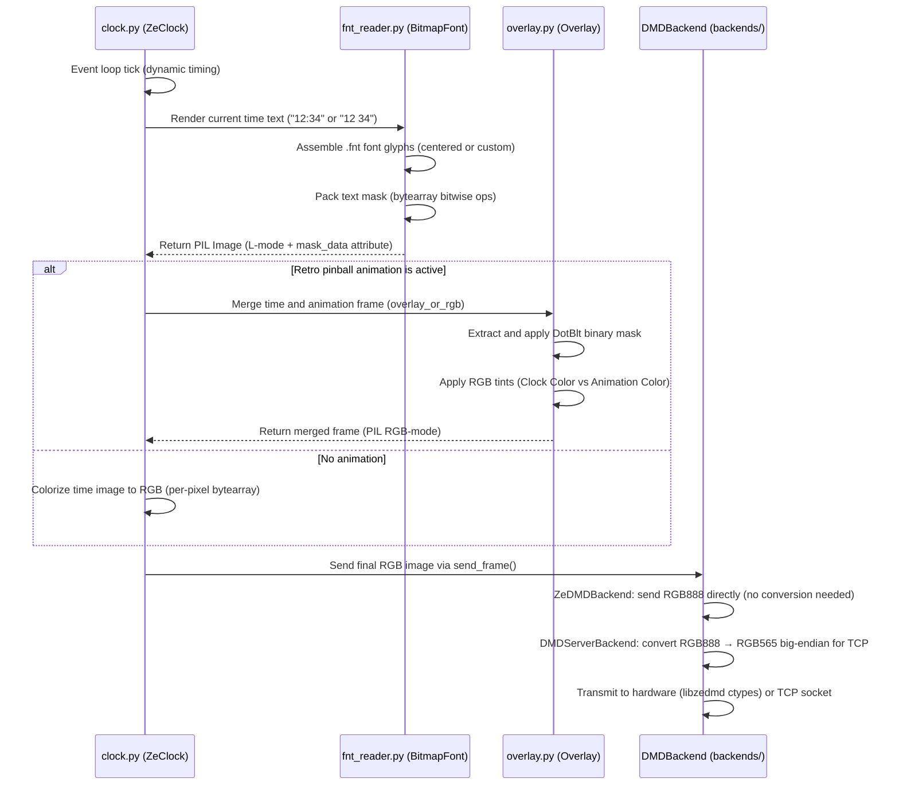
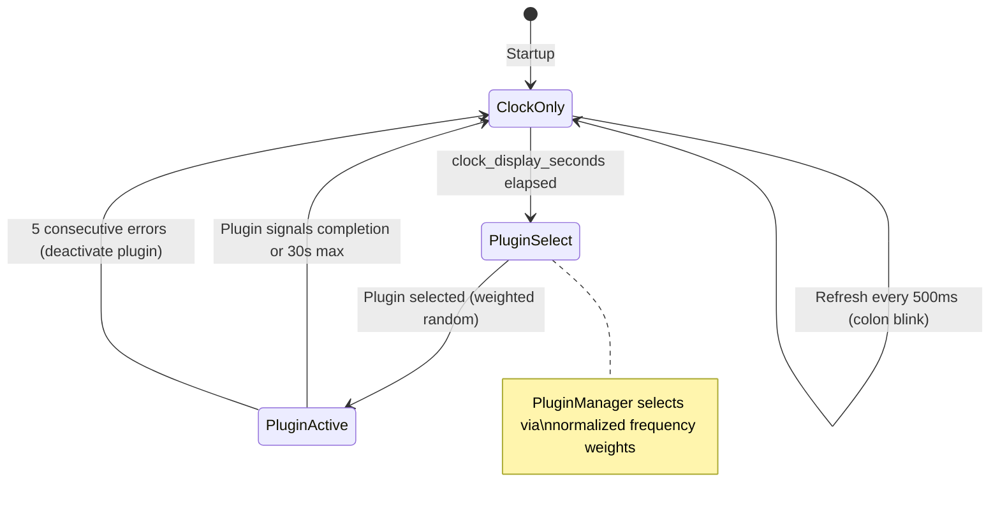

# zeClock Architecture

This document describes the overall architecture, rendering data flow, and hardware pipeline of the **zeClock** project.

---

## 🗺️ Global Architecture (Data Flow)

**zeClock** is an asynchronous Python client application that communicates with ZeDMD hardware through a pluggable backend system. The default backend (`ZeDMDBackend`) drives the display directly via `libzedmd` (C shared library called through Python ctypes). An alternative backend (`DMDServerBackend`) communicates over TCP with a separate `dmdserver` process, useful for development with `virtual-dmd.py`.

---

## 🧩 Application Component Architecture

### 1. Main Orchestrator: `ZeClock` (`clock.py`)

Manages global state and the time-based execution loop.

- **Render Loop (Tick Event)**: Runs as an async background task. Precisely calculates the remaining delay before the next frame to call `asyncio.sleep` and stabilize the framerate (25 FPS by default, or per-scene timing).
- **Animation State Machine**: Coordinates transitions between "Clock Only" mode and "Attract Mode" (retro pinball animations). After 5 seconds of inactivity, a new animation is randomly selected.
- **Async Pre-computer (`_precompute_animation`)**: To avoid any slowdown during real-time rendering, an async task loads a randomly chosen `.scn` animation, merges each frame with the current time (in two versions: with and without the colon `:` for blinking) and stores everything in RAM. The PinballPlugin and GifPlugin further optimize this by running pre-computation in a **background thread**, appending frames progressively so rendering can start before all frames are ready.
- **Dual Color**: Supports independent colors for the clock and animations, with an `auto` mode that rotates colors every 60 seconds.
- **CLI Entry Point**: The `main()` function exposes `--color`, `--animation-color`, and `--bootstrap` arguments.

### 2. Remote Control Layer (`remote/`)

Protocol-agnostic remote control with MQTT and REST API interfaces running as concurrent asyncio tasks. See [Section 8](#8-remote-control-remote) for full details.

**Command priority in the render loop:**
1. Text overlay (highest — temporary, expires after configured duration)
2. Screen off override (all-black frame)
3. Forced plugin (stays on the specified plugin until cleared)
4. Normal state machine (clock → plugin rotation)

**Text overlay rendering** uses a PIL TrueType font with auto-scaling:
1. Loads `default.ttf` from the bundled fonts directory (sized proportionally to display height).
2. Auto-shrinks the font size until the text fits within the display width (with 2px margin).
3. Falls back to PIL's built-in default font if the TrueType font is unavailable.
Text is rendered centered on screen using the clock color.

### 3. Backend Abstraction Layer (`backends/`)

Pluggable backend system for DMD communication. All backends implement the `DMDBackend` abstract base class, ensuring the clock and plugins remain backend-agnostic.

- **`DMDBackend` ABC (`backends/base.py`)**: Defines the common interface:
  - `connect() -> bool`: Establish connection to the display.
  - `send_frame(image, buffered, color) -> bool`: Send a frame to the display.
  - `disconnect() -> None`: Close the connection.
  - `connected` property: Whether the backend is currently connected.
  - Context manager protocol (`__enter__` / `__exit__`): Calls `connect()` / `disconnect()` automatically.
- **`ZeDMDBackend` (`backends/zedmd.py`)**: Direct hardware communication via `libzedmd` (C shared library loaded through ctypes). Sends frames as RGB888 directly via `ZeDMD_RenderRgb888`, avoiding any Python-level pixel conversion. Supports WiFi and USB connections. On connect, auto-detects the physical panel dimensions via `ZeDMD_GetPanelWidth`/`ZeDMD_GetPanelHeight` and enables upscaling (`ZeDMD_EnableUpscaling`) so libzedmd handles centering/scaling when the frame size differs from the panel size. The upscale algorithm is controlled by `BackendConfig.upscale_mode` (`epx` by default, `hq2x`, or `nearest`). Uses a simple error detection strategy: a log callback registered with libzedmd (`ZeDMD_SetLogCallback`) sets a thread-safe error flag on stream errors (StreamBytes failures, serial/TCP/UDP errors). On the next `send_frame()` call, the flag is checked — if set, the instance is closed immediately and `False` is returned. The caller (main loop in `clock.py`) handles the wait and reconnection with exponential backoff (initial 2s, max 30s, ×1.5 multiplier). A `threading.Lock` protects the error flag between the libzedmd internal thread and the Python asyncio thread.
- **`DMDServerBackend` (`backends/dmdserver.py`)**: TCP client using the DMDStream protocol (refactored from `dmdserver_client.py`). Used for development with `virtual-dmd.py`.
- **`BackendFactory` (`backends/factory.py`)**: Instantiates the correct backend based on `--backend` CLI argument (`auto`, `zedmd`, `dmdserver`). In `auto` mode, tries ZeDMD first, falls back to dmdserver.

#### DMDStream Protocol (used by DMDServerBackend)

- **Header** (big-endian):
  - Magic word: `DMDStream\x00` (10 bytes)
  - Version: 1 (uint8)
  - Mode: 3 = RGB565 (uint32 big-endian)
  - Dimensions: width, height (uint16 big-endian)
  - Flags: buffered, disconnectOthers (uint8 each)
  - Data size: payload length (uint32 big-endian)
- **Payload**: RGB565 big-endian data (2 bytes per pixel).
- **Persistent connection**: Socket stays open between frames for continuous streaming.

### 4. Binary File Readers (`readers/`)

Optimized parsers for decoding native DotClk hardware formats:

- **`BitmapFont` (`fnt_reader.py`)**: Decodes the binary `.fnt` format. Reads font headers (version, name, character count), maps ASCII characters with their advance width and kerning info, decompresses the global bitmap encoded at 4 bits per pixel (2 pixels per byte, dotmap format with header), and extracts individual grayscale glyphs. When rendering on HD displays (256×64) with SD fonts, `render_text()` renders at native resolution then delegates 2× upscaling to `overlay.upscale_2x()` (EPX, hq2x, or nearest-neighbor), controlled by the `upscale_mode` parameter. HD fonts (name ending with `_HD`) render directly at target size without upscaling.
- **`Scene` (`scn_reader.py`)**: Decodes the binary `.scn` animation format. Extracts the storyboard containing display metadata:
  - `first_frame_delay` / `last_frame_delay`: Hold delays on first/last frame (ms).
  - `first_blank` / `last_blank`: Whether display should be blank during those delays.
  - `clock_style`: Clock style (0 = Standard centered, 1 = Custom coordinates).
  - `custom_x` / `custom_y`: Custom clock position coordinates.
  - `frame_layer`: Layer order (0 = Clock behind animation, 1 = Clock above).
  - `frame_delay_ms`: Delay between frames (default 40ms = 25 FPS).

### 5. Composition Engine: `Overlay` (`overlay.py`)

This module handles image merging (clock on one side, animation on the other) and pixel-art upscaling. It faithfully implements the original DotClk hardware **`DotBlt`** algorithm and serves as the single entry point for all pixel-art upscaling in zeClock.

Mask metadata (`mask_data`, `mask_width_bytes`) is attached dynamically to PIL Image objects by the binary readers and accessed via typed `Any` casts in the overlay compositor.

- Each animation frame or bitmap text carries a binary mask (`mask_data`).
- **DotBlt Algorithm**:
  - If the upper layer's mask bit is `0`, the upper image pixel is applied (overwriting the background).
  - If the mask bit is `1`, the background pixel is preserved.
- **Dual Colorization** via `overlay_or_rgb`: Monochrome grayscale images are dynamically projected into RGB space. The clock receives the `color` (e.g., Orange) and the animation receives the `animation_color` (e.g., Blue), ensuring perfect readability of clock digits over retro pinball animations.
- **Pixel-art upscaling** — public API used by `BitmapFont.render_text()` and any other caller that needs to scale SD content to HD displays:
  - `upscale_nx(img, scale, mode)`: General dispatcher for arbitrary integer scale factors. Routes to the best algorithm for the given scale: `upscale_2x` for scale=2, `scale3x` for scale=3 with `mode="epx"`, and nearest-neighbor for all other scales. This is the preferred entry point when the scale factor is not known at compile time.
  - `upscale_2x(img, mode)`: Dispatcher for 2× upscaling. `mode="epx"` (default), `mode="hq2x"`, or `mode="nearest"`.
  - `epx_upscale_2x(img)`: EPX/Scale2x algorithm. Smooths diagonal edges and corners without introducing new colors or blurring. A hole-prevention rule ensures filled pixels are never replaced by empty ones (avoids gaps at inner corners of shapes such as "E"). Works on mode `L` (grayscale) images.
  - `hq2x(img)`: hq2x (High Quality 2×) algorithm by Maxim Stepin. Produces smoother curves and anti-aliased diagonals via neighbor interpolation. May introduce intermediate gray values. Best for pre-computed content (fonts, animations) where upscaling happens once at initialization. Works on mode `L` (grayscale) images.
  - `nearest_upscale_2x(img)`: Simple pixel doubling via `Image.Resampling.NEAREST`. Fastest method, works on any PIL image mode.
  - `scale3x(img)`: Scale3x/AdvMAME3x algorithm. Generalizes EPX to the 3× case — each source pixel expands to a 3×3 output block using neighbor comparisons on the full 3×3 neighborhood. Never introduces new colors; preserves pixel-art style. Useful for 3× scale factors (e.g., 128×32 → 384×96). Works on mode `L` (grayscale) images.
  - `_upscale_mask_2x(...)`: Internal helper that expands a DotBlt bit-mask 2× (each set bit → 2×2 block) so DotBlt compositing remains correct after scaling. Called automatically by both 2× upscalers when `mask_data` is present on the source image.
  - `_upscale_mask_nx(...)`: Internal helper that expands a DotBlt bit-mask by an arbitrary integer scale factor N (each set bit → N×N block). Used by `scale3x` and the nearest-neighbor fallback in `upscale_nx` to keep DotBlt compositing correct at any scale.

### 6. Plugin System (`plugins/`, `plugin_manager.py`, `plugin_registry.py`, `plugin_config.py`)

Extensible plugin architecture that allows contributors to author display plugins alternating with the default clock display during attract mode.

- **`PluginManager` (`plugin_manager.py`)**: Top-level orchestrator for the plugin lifecycle. Responsibilities:
  - **Discovery**: Scans built-in plugins (`zeclock/plugins/`) then user plugins (`~/.zeclock/plugins/`), importing Python files and finding `ClockPlugin` subclasses.
  - **Validation**: Checks plugin name format, description, and frame_delay_ms before registration.
  - **Loading**: Instantiates plugin classes, handles import errors gracefully (logs WARNING, skips file).
  - **Override logic**: User plugins with the same name as a built-in plugin replace the built-in.
  - **Configuration injection**: Merges plugin-specific YAML config with a `_helpers` key containing the `PluginHelpers` instance.
  - **Scheduling**: Selects the next plugin via weighted random selection from normalized frequencies.
  - **Activation**: Calls `initialize(config)` with a 10-second timeout; marks plugin as failed on error.
  - **Frame rendering**: Calls `render_frame()` with a 2-second timeout; holds last good frame on errors; deactivates after 5 consecutive failures.
  - **Duration enforcement**: Stops a plugin after 30 seconds or when it returns `None`.
- **`PluginRegistry` (`plugin_registry.py`)**: Internal data structure holding all loaded plugins with their state (active, failed), frequency, error count, and source (builtin/user). Provides frequency normalization so active plugins always sum to 100%.
- **`PluginConfig` (`plugin_config.py`)**: Loads `~/.zeclock/config/plugins.yaml`, creates defaults if missing, clamps values (frequency 0–100, clock_display_seconds 1–300), and handles invalid YAML gracefully.
- **`ClockPlugin` ABC (`base.py`)**: Defines the plugin interface contract. Plugins must implement:
  - `name` property: unique identifier (1–64 lowercase alphanumeric, hyphens, underscores).
  - `description` property: human-readable description (1–256 characters).
  - `frame_delay_ms` property: desired delay between frames (20–5000 ms).
  - `async initialize(config)`: prepare the plugin for rendering.
  - `async render_frame(width, height)`: produce a single RGB PIL Image frame, or `None` to signal completion.
  - `async cleanup()`: release resources on deactivation.
- **`PagedPlugin` (`base.py`)**: Abstract subclass of `ClockPlugin` for plugins that cycle through multiple display pages. Handles frame counting, page advancement, and automatic completion signaling. Subclasses implement `render_page(page, width, height)` instead of `render_frame()`. Accepts `page_duration_seconds` (2–30s, default 4) and manages internal paging state via `_init_paging()`.
- **Validation Utilities**: `validate_plugin_name()` and `validate_plugin_description()` enforce naming and description constraints at registration time.
- **Built-in Plugins**:
  - **PinballPlugin** (`pinball_plugin.py`): Wraps the existing `.scn` animation playback logic with DotBlt clock overlay composition. Randomly selects a scene file, pre-computes frames **progressively in a background thread** so `render_frame()` can start serving frames before all are ready — the clock keeps rendering while computation continues. Respects storyboard metadata (clock_style, custom_x, custom_y, frame_layer), and supports independent clock/animation colors. Thread-safe access to the frame list is protected by a `threading.Lock`.
  - **PongPlugin** (`pong_plugin.py`): Animated Pong game with real scoring and human-like AI. Two paddles play with randomized imperfections (reaction delay, limited speed, prediction error). The ball speeds up after each rally. A game resets after one side reaches 5 points or the plugin duration expires. Features score flash animations, serve delay blinking, and renders scores using the MENU font.
  - **GifPlugin** (`gif_plugin.py`): Picks a random animated GIF from a configurable directory (`~/.zeclock/plugins/gif/` by default), extracts frames **progressively in a background thread** so `render_frame()` can start serving frames before all are ready — the clock keeps rendering during loading. Scales frames to fit the display dimensions using a two-path strategy (pixel-perfect GIFs whose dimensions are exact integer multiples of the display size use the configured upscale algorithm — `epx`, `hq2x`, or `nearest` — while GIFs requiring arbitrary rescaling use LANCZOS). Thread-safe access to the frame list is protected by a `threading.Lock`. Plays the animation once, then signals completion.
  - **WeatherPlugin** (`weather_plugin.py`): Fetches weather data from the Open-Meteo API and cycles through display pages (current conditions, tomorrow's forecast, 3-day outlook) with configurable page duration. Supports 15-minute caching, staleness indicators, and Celsius/Fahrenheit units.
  - **SpeakerTimerPlugin** (`speaker_timer_plugin.py`): Conference countdown timer designed for stage visibility. Displays large countdown digits with automatic color transitions based on remaining time (green → yellow at 5 min → red at 1 min). Supports start/pause/reset via class-level methods called by the web API, configurable presets (Lightning 5 min, Short 20 min, Standard 45 min), and overtime counting (switches to count-up with negative display after reaching zero). Uses class-level state to persist across activations and never signals completion on its own — stays active until force-deactivated. Blinks the display when paused.
  - **StockPlugin** (`stock_plugin.py`): Fetches stock quotes from Yahoo Finance (no API key required) and displays current price, daily change, and change percentage for configured ticker symbols. Shows one symbol per page with configurable page duration. Detects market state (OPEN, PRE, POST, CLOSED) and displays extended hours price and variation when in pre/post market. Supports 10-minute caching with a staleness indicator.
- **`PluginHelpers` (`helpers.py`)**: Shared rendering utilities injected into plugins at initialization. Provides:
  - `create_frame()`: Creates blank RGB PIL Images at the correct display dimensions.
  - `render_text()`: Renders text using the BitmapFont system with positioning and colorization.
  - `draw_icon()`: Draws 16×16 pixel-art icons from raw bitmap data onto frames.
  - `composite_frames()`: Merges foreground onto background using DotBlt-style OR blending (non-black pixels overwrite).
  - `get_font_names()` / `get_text_width()`: Font discovery and text measurement for layout calculations.
  - `draw_staleness_indicator()`: Draws a blinking red dot in the top-right corner when data is stale (used by WeatherPlugin and StockPlugin).
  - `ConfettiAnimation`: Reusable particle animation class. Particles shoot upward from configurable cannon positions and fall with gravity. Supports three intensity levels (`small`/`medium`/`big`) and multiple color palettes (`CONFETTI_COLORS_PARTY`, `CONFETTI_COLORS_WARM`, `CONFETTI_COLORS_COOL`).

### 7. Brightness Scheduler (`brightness_scheduler.py`)

Manages automatic brightness adjustment based on time-of-day schedules, day-of-week rules, and sunrise/sunset data.

- **Day-of-week scheduling**: Configurable time ranges with brightness percentages per day (e.g., Monday 08:00–16:00 → 50%). Falls back to a `default` schedule when no day-specific rule matches.
- **Sunrise/sunset integration**: Fetches sun times from the sunrise-sunset.org API (no API key required), caches for 30 minutes, and applies day/night brightness levels automatically based on geographic location.
- **Dual brightness control**: Maps user-facing 0–100% brightness to a combination of hardware brightness (0–15) and software dimming (0–100%). Ultra-low brightness (below HW minimum) is achieved via progressive SW dimming at HW level 1.
- **"Time only" mode**: Disables plugins during configured hours (e.g., nighttime) — only the clock is displayed at minimum brightness.
- **Animation suppression**: Optionally disables animations during configured hours (e.g., 22:00–08:00).
- **Efficient caching**: Checks once per minute and caches the result to avoid repeated computation.
- **`apply_sw_dimming(image, dim_percent)`**: Fast software dimming using Pillow's `point()` with a pre-built LUT (C-native processing, no NumPy dependency).

### 8. Remote Control (`remote/`)

Module providing external control of the running zeClock instance via network protocols. Both MQTT and REST interfaces share a common `CommandHandler` that translates incoming commands into actions on the ZeClock instance.

- **`CommandHandler` (`remote/command_handler.py`)**: Central command execution logic. Defines `RemoteCommand` data structures and dispatches commands (screen on/off, force plugin, display free text, adjust brightness) to the appropriate ZeClock methods.
- **`MqttRemote` (`remote/mqtt_remote.py`)**: MQTT-based remote control. Primary protocol for bidirectional communication:
  - Publishes state (active plugin, brightness, on/off status).
  - Subscribes to command topics (on/off, force plugin, display text).
  - Supports Home Assistant MQTT Discovery for automatic entity creation.
- **`RestRemote` (`remote/rest_remote.py`)**: REST API (HTTP) for simple integrations, Recalbox Web Manager compatibility, and the built-in Web UI. Provides endpoints for the same command set as MQTT, plus a plugin listing endpoint and a dedicated Speaker Timer sub-API. Serves a static Web UI from `remote/web/` at `/ui/` (with root `/` redirecting to it).
  - **Web UI**: Static HTML/JS/CSS served from `zeclock/remote/web/`. Provides a browser-based control panel for the clock (accessible at `http://<host>:<port>/`).
  - **Plugin list endpoint** (`GET /api/plugins`): Returns all registered plugins with their state, frequency, source, active/forced status, and optional `web_controls` metadata.
  - **Brightness sub-API** (`/api/brightness`): `GET` returns current brightness state (override value, SW dimming level, time-only mode, auto/manual mode). `POST` sets manual brightness (0–15). `POST /api/brightness/auto` resumes automatic brightness scheduling.
  - **Speaker Timer sub-API** (`/api/speaker-timer/*`): Dedicated endpoints for controlling the SpeakerTimerPlugin remotely — status, start (also forces the plugin active), pause, reset (also resumes normal rotation), and set duration.

### 9. Automatic Bootstrap: `Installer` (`installer.py`)

Runtime initialization module that detects and automatically installs system dependencies:

- **Platform Detection**: Linux x64/aarch64, macOS arm64/x64, Windows x64.
- **libzedmd Installation**: Downloads the latest release from `PPUC/libzedmd` on GitHub to `~/.zeclock/lib/`.
- **DotClk Animations Installation**: Downloads 2300+ animations from `sigmafx/DotClk-Resources`. Fonts are bundled in the package (`zeclock/resources/fonts/`) and do not require downloading.
- **Interactive or Automatic Mode**: User prompt by default, or `--bootstrap` for silent installation.
- **dmdserver Installation** (optional): Available via `--with-dmdserver` for development setups.

---

## 🎨 Frame Rendering Pipeline

Logical steps executed each frame to build the final image sent to the display:

---

## 🔄 Animation State Machine

- **ClockOnly**: Displays time with colon blinking every 500ms. Duration configurable via `clock_display_seconds` (default 5s).
- **PluginSelect**: PluginManager selects the next plugin using weighted random selection from normalized frequencies.
- **PluginActive**: The selected plugin renders frames at its configured `frame_delay_ms`. Ends when the plugin returns `None`, 30 seconds elapse, or 5 consecutive errors occur.
- **Fallback**: If all plugins are deactivated due to errors, the system falls back to the built-in pinball animation behavior.
