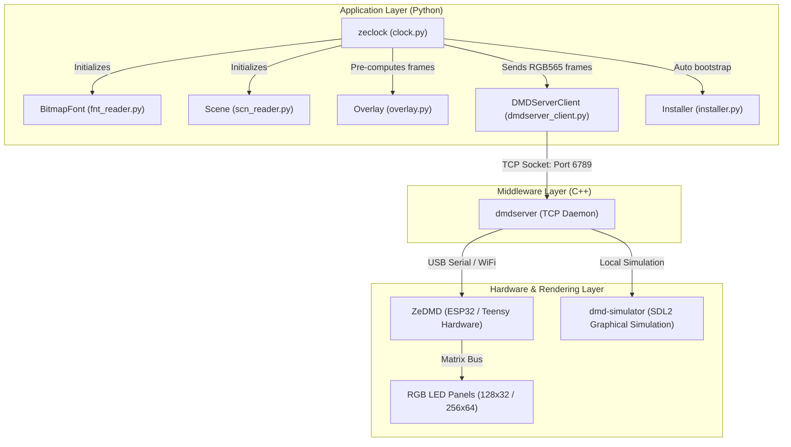
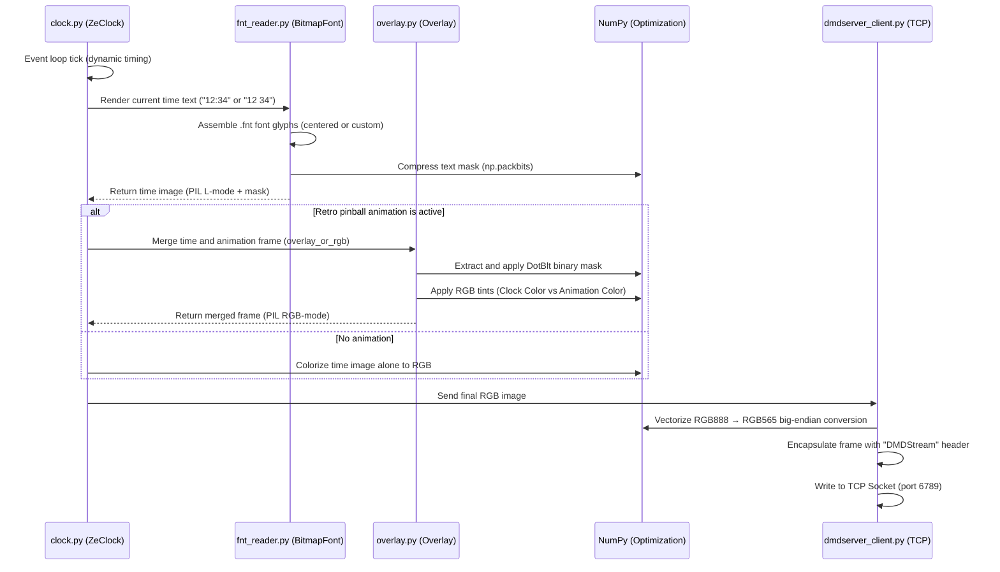
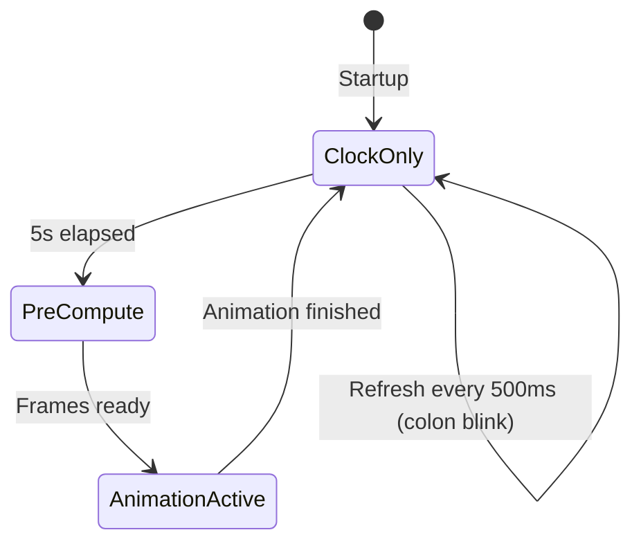

# zeClock Architecture

This document describes the overall architecture, rendering data flow, and hardware pipeline of the **zeClock** project.

---

## 🗺️ Global Architecture (Data Flow)

**zeClock** is an asynchronous Python client application that communicates over the network with a low-level C++ server (`dmdserver`), which handles display output on a physical ZeDMD LED panel or an emulated display.

---

## 🧩 Application Component Architecture

### 1. Main Orchestrator: `ZeClock` (`clock.py`)

Manages global state and the time-based execution loop.

- **Render Loop (Tick Event)**: Runs as an async background task. Precisely calculates the remaining delay before the next frame to call `asyncio.sleep` and stabilize the framerate (25 FPS by default, or per-scene timing).
- **Animation State Machine**: Coordinates transitions between "Clock Only" mode and "Attract Mode" (retro pinball animations). After 5 seconds of inactivity, a new animation is randomly selected.
- **Async Pre-computer (`_precompute_animation`)**: To avoid any slowdown during real-time rendering, an async task loads a randomly chosen `.scn` animation, merges each frame with the current time (in two versions: with and without the colon `:` for blinking) and stores everything in RAM.
- **Dual Color**: Supports independent colors for the clock and animations, with an `auto` mode that rotates colors every 60 seconds.
- **CLI Entry Point**: The `main()` function exposes `--color`, `--animation-color`, and `--bootstrap` arguments.

### 2. Network Client: `DMDServerClient` (`dmdserver_client.py`)

Handles the optimized network interface with the DMD server.

- **DMDStream Protocol Serialization**: Forges a binary network header (big-endian) containing:
  - Magic word: `DMDStream\x00` (10 bytes).
  - Protocol version: 1 (uint8).
  - Payload format: 3 = RGB565 (uint32 big-endian).
  - Screen geometry: width, height (uint16 big-endian).
  - Buffered flag (uint8).
  - `disconnectOthers` flag (uint8).
  - Total pixel data size (uint32 big-endian).
- **Optimized RGB565 Conversion**: Using NumPy, converts standard RGB24 channels (3 bytes) to compact 16-bit RGB565 format (5 bits Red, 6 bits Green, 5 bits Blue) in big-endian via vectorized bit shifts.
- **Persistent Connection**: Keeps the TCP socket open between frames for continuous streaming.

### 3. Binary File Readers (`readers/`)

Optimized parsers for decoding native DotClk hardware formats:

- **`BitmapFont` (`fnt_reader.py`)**: Decodes the binary `.fnt` format. Reads font headers (version, name, character count), maps ASCII characters with their advance width and kerning info, decompresses the global bitmap encoded at 4 bits per pixel (2 pixels per byte, dotmap format with header), and extracts individual grayscale glyphs.
- **`Scene` (`scn_reader.py`)**: Decodes the binary `.scn` animation format. Extracts the storyboard containing display metadata:
  - `first_frame_delay` / `last_frame_delay`: Hold delays on first/last frame (ms).
  - `first_blank` / `last_blank`: Whether display should be blank during those delays.
  - `clock_style`: Clock style (0 = Standard centered, 1 = Custom coordinates).
  - `custom_x` / `custom_y`: Custom clock position coordinates.
  - `frame_layer`: Layer order (0 = Clock behind animation, 1 = Clock above).
  - `frame_delay_ms`: Delay between frames (default 40ms = 25 FPS).

### 4. Composition Engine: `Overlay` (`overlay.py`)

This module handles image merging (clock on one side, animation on the other). It faithfully implements the original DotClk hardware **`DotBlt`** algorithm:

- Each animation frame or bitmap text contains a binary mask (`mask_data`).
- **DotBlt Algorithm**:
  - If the upper layer's mask bit is `0`, the upper image pixel is applied (overwriting the background).
  - If the mask bit is `1`, the background pixel is preserved.
- **Dual Colorization** via `overlay_or_rgb`: Monochrome grayscale images are dynamically projected into RGB space. The clock receives the `color` (e.g., Orange) and the animation receives the `animation_color` (e.g., Blue), ensuring perfect readability of clock digits over retro pinball animations.

### 5. Automatic Bootstrap: `Installer` (`installer.py`)

Runtime initialization module that detects and automatically installs system dependencies:

- **Platform Detection**: Linux x64/aarch64, macOS arm64/x64, Windows x64.
- **dmdserver Installation**: Downloads the latest release from `vpinball/libdmdutil` on GitHub.
- **DotClk Resources Installation**: Downloads fonts and 2300+ animations from `sigmafx/DotClk-Resources`.
- **Interactive or Automatic Mode**: User prompt by default, or `--bootstrap` for silent installation.

---

## 🎨 Frame Rendering Pipeline

Logical steps executed each frame to build the final image sent to the display:

---

## 🔄 Animation State Machine

- **ClockOnly**: Displays time with colon blinking every 500ms.
- **PreCompute**: Loads a random animation in the background, merges each frame with the current time.
- **AnimationActive**: Plays pre-computed frames at the scene-defined cadence.
