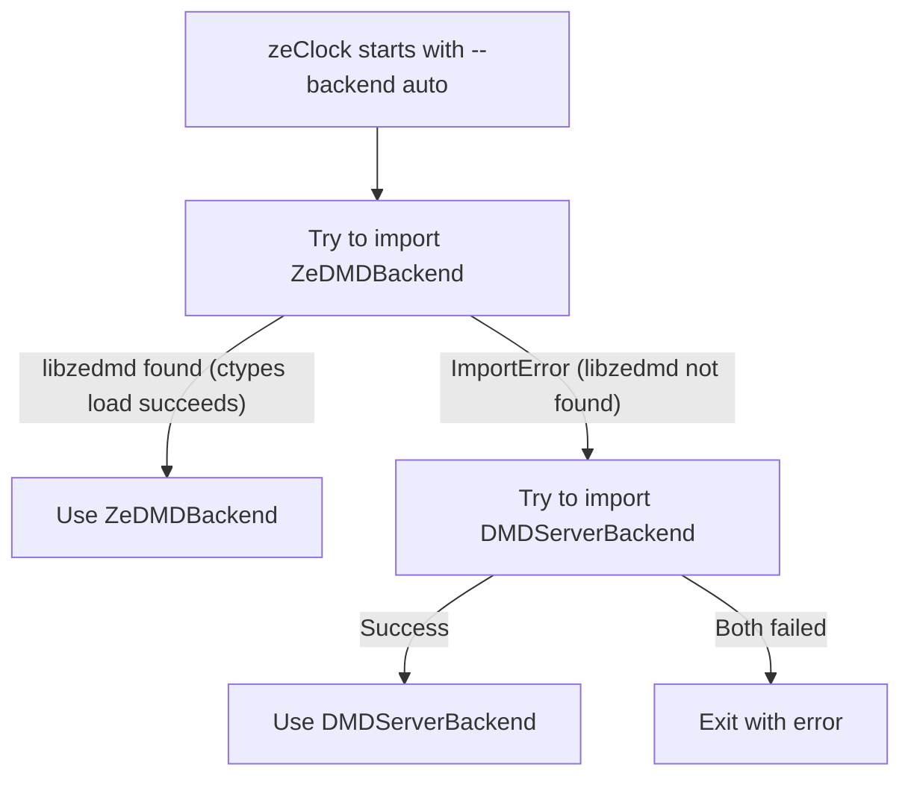

# Backend Guide

This document explains the zeClock backend system: why backends exist, how automatic selection works, when to choose a specific backend, and per-backend configuration options.

---

## 🎯 Overview

zeClock uses a **backend abstraction layer** to decouple the rendering engine from the display hardware. This design serves two goals:

1. **Production** -- The `zedmd` backend communicates directly with ZeDMD hardware via `libzedmd` (C shared library loaded through Python ctypes). This is the fastest path: RGB888 frames are sent directly to the panel without any Python-level pixel conversion.

2. **Development** -- The `dmdserver` backend streams frames over TCP to a separate daemon (`dmdserver`) or to the browser-based `virtual-dmd.py` renderer. No hardware is required; you can develop and test on any machine.

Both backends implement the same `DMDBackend` abstract base class, so the clock, plugins, and rendering pipeline remain completely backend-agnostic.

---

## 🔀 Backend Selection (`auto` Mode)

When `--backend auto` is used (the default), zeClock applies the following fallback logic:



1. **Attempt ZeDMDBackend** -- The factory performs a lazy import of `ZeDMDBackend`. This triggers a `ctypes.CDLL` load of `libzedmd.so` (or `.dylib` / `.dll`). If the shared library is not present in `~/.zeclock/lib/`, an `ImportError` is raised and caught.
2. **Fall back to DMDServerBackend** -- If step 1 fails, the factory instantiates `DMDServerBackend` (TCP client). This always succeeds at instantiation time (connection happens later on `connect()`).
3. **Both unavailable** -- If both fail, zeClock exits with a clear error message listing both failure reasons.

> **Tip**: Run `zeclock --bootstrap` to install `libzedmd` automatically. Once installed, `auto` mode will always prefer the direct hardware path.

---

## 🔌 ZeDMD Backend

### When to use

Use `--backend zedmd` when you have ZeDMD-compatible hardware (ESP32 or Teensy board driving RGB LED panels) and want the lowest latency, most efficient display path.

### Connection modes

| Mode | CLI Option | Config Key | Description |
|------|-----------|------------|-------------|
| **WiFi** | `--wifi-addr 192.168.0.35` | `[zedmd] wifi_addr` | Connects via WiFi to the ZeDMD IP address |
| **USB Serial** | `--device /dev/ttyUSB0` | `[zedmd] device` | Connects via USB serial port |
| **Auto-detect** | *(neither specified)* | *(neither set)* | libzedmd auto-detects the connected device |

> If both `wifi_addr` and `device` are configured, WiFi takes precedence and the USB device is ignored.

### Features

| Feature | Details |
|---------|---------|
| **Pixel format** | RGB888 (3 bytes/pixel) -- sent directly from PIL Image bytes, no Python conversion |
| **Panel auto-detection** | Queries `ZeDMD_GetPanelWidth` / `ZeDMD_GetPanelHeight` on connect to adapt to 128x32 or 256x64 panels |
| **Brightness** | Hardware brightness 0-15, configurable via `--brightness` or `[zedmd] brightness` |
| **Upscaling** | Delegates to libzedmd via `ZeDMD_EnableUpscaling` when frame size differs from panel size |
| **Error detection** | A log callback registered with libzedmd intercepts stream errors (serial failures, TCP/UDP errors) and sets a thread-safe error flag |
| **Reconnection** | On error, `send_frame()` returns `False`; the main loop retries with exponential backoff (initial 2s, max 30s, multiplier 1.5) |

### Configuration

In `~/.zeclock/config/zeclock.ini`:

```ini
[zedmd]
wifi_addr = 192.168.0.35    # WiFi IP (optional)
device = /dev/ttyUSB0        # USB serial path (optional)
brightness = 10              # Hardware brightness 0-15 (default: 10)
```

---

## 🖥️ DMDServer Backend

### When to use

Use `--backend dmdserver` (or rely on `auto` fallback) when:

- You are **developing** on a PC/Mac without ZeDMD hardware
- You want to use the **browser-based virtual DMD** (`make dev-start-virtual`)
- You are running a `dmdserver` daemon that forwards frames to other consumers (SDL2 simulator, recording tools, etc.)

### How it works

The DMDServer backend is a TCP client that connects to a `dmdserver` process (default: `localhost:6789`). Each frame is sent using the **DMDStream protocol**:

| Field | Size | Value |
|-------|------|-------|
| Magic | 10 bytes | `DMDStream\x00` |
| Version | 1 byte | `1` |
| Mode | 4 bytes (uint32 BE) | `3` (RGB565) |
| Width | 2 bytes (uint16 BE) | Frame width |
| Height | 2 bytes (uint16 BE) | Frame height |
| Buffered | 1 byte | `1` (double-buffered) |
| Disconnect Others | 1 byte | `1` |
| Data Size | 4 bytes (uint32 BE) | `width * height * 2` |
| **Payload** | variable | RGB565 big-endian pixel data |

**Total header**: 25 bytes, followed by the pixel payload.

### Optimizations

- **Frame identity caching**: If the current frame is identical to the previous one, the send is skipped entirely (reduces TCP traffic for static displays).
- **Pre-computed RGB565 LUT**: Per-channel lookup tables convert RGB888 to RGB565 without per-pixel arithmetic at runtime.

### Configuration

In `~/.zeclock/config/zeclock.ini`:

```ini
[dmdserver]
host = localhost    # dmdserver host (default: localhost)
port = 6789         # dmdserver TCP port (default: 6789)
```

---

## 📋 Configuration Reference

All backend-related configuration keys with their CLI overrides:

| Config Section | Key | CLI Override | Values | Default | Description |
|---------------|-----|-------------|--------|---------|-------------|
| *(top-level)* | — | `--backend` | `auto`, `zedmd`, `dmdserver` | `auto` | Backend selection mode |
| `[zedmd]` | `wifi_addr` | `--wifi-addr` | IP address | — | ZeDMD WiFi address |
| `[zedmd]` | `device` | `--device` | device path | — | ZeDMD USB serial device |
| `[zedmd]` | `brightness` | `--brightness` | 0-15 | 10 | Hardware display brightness |
| `[dmdserver]` | `host` | — | hostname/IP | `localhost` | dmdserver TCP host |
| `[dmdserver]` | `port` | — | integer | 6789 | dmdserver TCP port |
| `[display]` | `width` | `--width` | integer | 128 | Frame width in pixels |
| `[display]` | `height` | `--height` | integer | 32 | Frame height in pixels |
| `[display]` | `upscale` | `--upscale` | `epx`, `hq2x`, `nearest` | `epx` | Upscale algorithm (used by libzedmd) |

**Priority order** (highest to lowest):
1. CLI arguments
2. Config file (`~/.zeclock/config/zeclock.ini`)
3. Built-in defaults

---

## 🤔 Decision Guide

| Scenario | Recommended Backend | Why |
|----------|-------------------|-----|
| Production with ZeDMD hardware | `auto` or `zedmd` | Direct hardware path, lowest latency, RGB888 passthrough |
| Development without hardware | `auto` or `dmdserver` | Falls back to TCP streaming with virtual-dmd.py in browser |
| Debugging connection issues | `zedmd` | Forces the hardware path so errors are explicit (no silent fallback) |
| CI / automated testing | `dmdserver` | No hardware dependency, deterministic TCP connection |
| Multiple display consumers | `dmdserver` | dmdserver daemon can forward frames to multiple targets |

---

## 🏗️ Architecture

For the full technical architecture (ABC design, factory pattern, protocol details, and rendering pipeline), see [architecture.md](architecture.md) section "Backend Abstraction Layer".

For protocol byte formats and performance targets, see [tech.md](tech.md).
